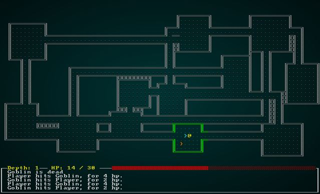

# Nicer Walls

---

***About this tutorial***

*This tutorial is free and open source, and all code uses the MIT license - so you are free to do with it as you like. My hope is that you will enjoy the tutorial, and make great games!*

*If you enjoy this and would like me to keep writing, please consider supporting [my Patreon](https://www.patreon.com/blackfuture).*

---

So far, we've used a very traditional rendering style for the map. Hash symbols for walls, periods for floors. It looks pretty nice, but games like *Dwarf Fortress* do a lovely job of using codepage 437's line-drawing characters to make the walls of the dungeon look smooth. This short chapter will show how to use a `bitmask` to calculate appropriate walls, and render them appropriately. As usual, we'll start from the code from the previous chapter (chapter 1.14).

## Counting neighbors to build our bitset

We have a decent map rendering system in `map.rs`, specifically the function `draw_map`. If you find the section that matches `tile` by type, we can start by extending the `Wall` selection:

```rust
TileType::Wall => {
    glyph = wall_glyph(&*map, x, y);
    fg = RGB::from_f32(0., 1.0, 0.);
}
```

This requires the `wall_glyph` function, so lets write it:

```rust
fn wall_glyph(map : &Map, x: i32, y:i32) -> u8 {
    if x < 1 || x > map.width-2 || y < 1 || y > map.height-2 as i32 { return 35; }
    let mut mask : u8 = 0;

    if is_revealed_and_wall(map, x, y - 1) { mask +=1; }
    if is_revealed_and_wall(map, x, y + 1) { mask +=2; }
    if is_revealed_and_wall(map, x - 1, y) { mask +=4; }
    if is_revealed_and_wall(map, x + 1, y) { mask +=8; }

    match mask {
        0 => { 9 } // Pillar because we can't see neighbors
        1 => { 186 } // Wall only to the north
        2 => { 186 } // Wall only to the south
        3 => { 186 } // Wall to the north and south
        4 => { 205 } // Wall only to the west
        5 => { 188 } // Wall to the north and west
        6 => { 187 } // Wall to the south and west
        7 => { 185 } // Wall to the north, south and west
        8 => { 205 } // Wall only to the east
        9 => { 200 } // Wall to the north and east
        10 => { 201 } // Wall to the south and east
        11 => { 204 } // Wall to the north, south and east
        12 => { 205 } // Wall to the east and west
        13 => { 202 } // Wall to the east, west, and south
        14 => { 203 } // Wall to the east, west, and north
        _ => { 35 } // We missed one?
    }
}
```

Lets step through this function:
1. If we are at the map bounds, we aren't going to risk stepping outside of them - so we return a `#` symbol (ASCII 35).
2. Now we create an 8-bit unsigned integer to act as our `bitmask`. We're interested in setting individual bits, and only need four of them - so an 8-bit number is perfect.
3. Next, we check each of the 4 directions and add to the mask. We're adding numbers corresponding to each of the first four bits in binary - so 1,2,4,8. This means that our final number will store whether or not we have each of the four possible neighbors. For example, a value of 3 means that we have neighbors to the north and south.
4. Then we match on the resulting mask bit, and return the appropriate line-drawing character from the [codepage 437 character set](http://dwarffortresswiki.org/index.php/Character_table)

This function in turn calls `is_revealed_and_wall`, so we'll write that too! It's very simple:

```rust
fn is_revealed_and_wall(map: &Map, x: i32, y: i32) -> bool {
    let idx = map.xy_idx(x, y);
    map.tiles[idx] == TileType::Wall && map.revealed_tiles[idx]
}
```
It simply checks to see if a tile is revealed, and if it is a wall - if both are true, it returns true - otherwise it returns false.

If you `cargo run` the project now, you get a nicer looking set of walls:



**The source code for this chapter may be found [here](https://github.com/thebracket/rustrogueliketutorial/tree/master/chapter-16-nicewalls)**

[Run this chapter's example with web assembly, in your browser (WebGL2 required)](https://bfnightly.bracketproductions.com/rustbook/wasm/chapter-16-nicewalls/)

---

Copyright (C) 2019, Herbert Wolverson.

---