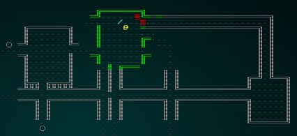

# Bloodstains

---

***About this tutorial***

*This tutorial is free and open source, and all code uses the MIT license - so you are free to do with it as you like. My hope is that you will enjoy the tutorial, and make great games!*

*If you enjoy this and would like me to keep writing, please consider supporting [my Patreon](https://www.patreon.com/blackfuture).*

---

Our character lives the life of a "murder-hobo", looting and slaying at will - so it only makes sense that the pristine dungeon will start to resemble a charnel house. It also gives us a bridge into a future chapter, in which we'll start to add some particle and visual effects (in ASCII/CP437) to the game.

## Storing the blood

Tiles either have blood or they don't, so it makes sense to attach them to the map as a `set`. So at the top of `map.rs`, we'll include a new storage type - `HashSet`:

```rust
use std::collections::HashSet;
```

In the map definition, we'll include a `HashSet` of `usize` (to represent tile indices) types for blood:

```rust
#[derive(Default, Serialize, Deserialize, Clone)]
pub struct Map {
    pub tiles : Vec<TileType>,
    pub rooms : Vec<Rect>,
    pub width : i32,
    pub height : i32,
    pub revealed_tiles : Vec<bool>,
    pub visible_tiles : Vec<bool>,
    pub blocked : Vec<bool>,
    pub depth : i32,
    pub bloodstains : HashSet<usize>,

    #[serde(skip_serializing)]
    #[serde(skip_deserializing)]
    pub tile_content : Vec<Vec<Entity>>
}
```

And in the new map generator, we'll initialize it:

```rust
let mut map = Map{
    tiles : vec![TileType::Wall; MAPCOUNT],
    rooms : Vec::new(),
    width : MAPWIDTH as i32,
    height: MAPHEIGHT as i32,
    revealed_tiles : vec![false; MAPCOUNT],
    visible_tiles : vec![false; MAPCOUNT],
    blocked : vec![false; MAPCOUNT],
    tile_content : vec![Vec::new(); MAPCOUNT],
    depth: new_depth,
    bloodstains: HashSet::new()
};
```

## Rendering the blood

We'll indicate a bloodstain by changing a tile background to a dark red. We don't want to be too "in your face" with the effect, and we don't want to hide the tile content - so that should be sufficient. We'll also not show blood that isn't in visual range, to keep it understated. In `map.rs`, the render section now looks like this:

```rust
if map.revealed_tiles[idx] {
    let glyph;
    let mut fg;
    let mut bg = RGB::from_f32(0., 0., 0.);
    match tile {
        TileType::Floor => {
            glyph = rltk::to_cp437('.');
            fg = RGB::from_f32(0.0, 0.5, 0.5);
        }
        TileType::Wall => {
            glyph = wall_glyph(&*map, x, y);
            fg = RGB::from_f32(0., 1.0, 0.);
        }
        TileType::DownStairs => {
            glyph = rltk::to_cp437('>');
            fg = RGB::from_f32(0., 1.0, 1.0);
        }
    }
    if map.bloodstains.contains(&idx) { bg = RGB::from_f32(0.75, 0., 0.); }
    if !map.visible_tiles[idx] { 
        fg = fg.to_greyscale();
        bg = RGB::from_f32(0., 0., 0.); // Don't show stains out of visual range
    }
    ctx.set(x, y, fg, bg, glyph);
}
```

## Blood for the blood god

Now we need to add blood to the scene! We'll mark a tile as bloody whenever someone takes damage in it. We'll adjust the `DamageSystem` in `damage_system.rs` to set the bloodstain:

```rust
impl<'a> System<'a> for DamageSystem {
    type SystemData = ( WriteStorage<'a, CombatStats>,
                        WriteStorage<'a, SufferDamage>,
                        ReadStorage<'a, Position>,
                        WriteExpect<'a, Map>,
                        Entities<'a> );

    fn run(&mut self, data : Self::SystemData) {
        let (mut stats, mut damage, positions, mut map, entities) = data;

        for (entity, mut stats, damage) in (&entities, &mut stats, &damage).join() {
            stats.hp -= damage.amount;
            let pos = positions.get(entity);
            if let Some(pos) = pos {
                let idx = map.xy_idx(pos.x, pos.y);
                map.bloodstains.insert(idx);
            }
        }

        damage.clear();
    }
}
```

If you `cargo run` your project, the map starts to show signs of battle!



**The source code for this chapter may be found [here](https://github.com/thebracket/rustrogueliketutorial/tree/master/chapter-16-nicewalls)**

---

Copyright (C) 2019, Herbert Wolverson.

---