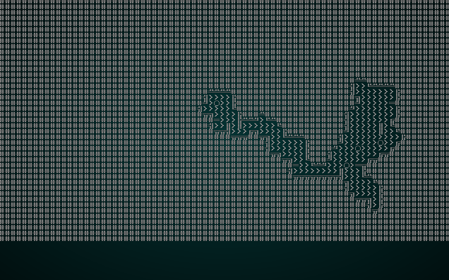
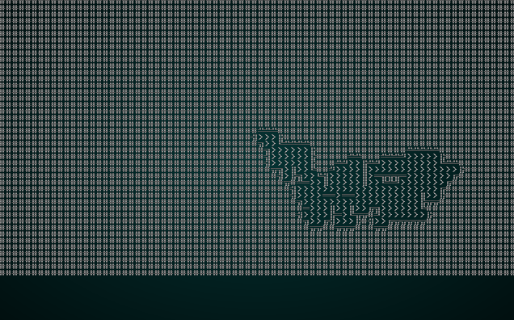

# Drunkard's Walk Maps

---

***About this tutorial***

*This tutorial is free and open source, and all code uses the MIT license - so you are free to do with it as you like. My hope is that you will enjoy the tutorial, and make great games!*

*If you enjoy this and would like me to keep writing, please consider supporting [my Patreon](https://www.patreon.com/blackfuture).*

---

Ever wondered what would happen if an Umber Hulk (or other tunneling creature) got *really* drunk, and went on a dungeon carving bender? The *Drunkard's Walk* algorithm answers the question - or more precisely, what would happen if a *whole bunch* of monsters had far too much to drink. As crazy it sounds, this is a good way to make organic dungeons.

## Initial scaffolding

As usual, we'll start with scaffolding from the previous map tutorials. We've done it enough that it should be old hat by now! In `map_builders/drunkard.rs`, build a new `DrunkardsWalkBuilder` class. We'll keep the zone-based placement from Cellular Automata - but remove the map building code. Here's the scaffolding:

```rust
use super::{MapBuilder, Map,  
    TileType, Position, spawner, SHOW_MAPGEN_VISUALIZER};
use rltk::RandomNumberGenerator;
use specs::prelude::*;
use std::collections::HashMap;

pub struct DrunkardsWalkBuilder {
    map : Map,
    starting_position : Position,
    depth: i32,
    history: Vec<Map>,
    noise_areas : HashMap<i32, Vec<usize>>
}

impl MapBuilder for DrunkardsWalkBuilder {
    fn get_map(&self) -> Map {
        self.map.clone()
    }

    fn get_starting_position(&self) -> Position {
        self.starting_position.clone()
    }

    fn get_snapshot_history(&self) -> Vec<Map> {
        self.history.clone()
    }

    fn build_map(&mut self)  {
        self.build();
    }

    fn spawn_entities(&mut self, ecs : &mut World) {
        for area in self.noise_areas.iter() {
            spawner::spawn_region(ecs, area.1, self.depth);
        }
    }

    fn take_snapshot(&mut self) {
        if SHOW_MAPGEN_VISUALIZER {
            let mut snapshot = self.map.clone();
            for v in snapshot.revealed_tiles.iter_mut() {
                *v = true;
            }
            self.history.push(snapshot);
        }
    }
}

impl DrunkardsWalkBuilder {
    pub fn new(new_depth : i32) -> DrunkardsWalkBuilder {
        DrunkardsWalkBuilder{
            map : Map::new(new_depth),
            starting_position : Position{ x: 0, y : 0 },
            depth : new_depth,
            history: Vec::new(),
            noise_areas : HashMap::new()
        }
    }

    #[allow(clippy::map_entry)]
    fn build(&mut self) {
        let mut rng = RandomNumberGenerator::new();

        // Set a central starting point
        self.starting_position = Position{ x: self.map.width / 2, y: self.map.height / 2 };
        let start_idx = self.map.xy_idx(self.starting_position.x, self.starting_position.y);

        // Find all tiles we can reach from the starting point
        let map_starts : Vec<usize> = vec![start_idx];
        let dijkstra_map = rltk::DijkstraMap::new(self.map.width, self.map.height, &map_starts , &self.map, 200.0);
        let mut exit_tile = (0, 0.0f32);
        for (i, tile) in self.map.tiles.iter_mut().enumerate() {
            if *tile == TileType::Floor {
                let distance_to_start = dijkstra_map.map[i];
                // We can't get to this tile - so we'll make it a wall
                if distance_to_start == std::f32::MAX {
                    *tile = TileType::Wall;
                } else {
                    // If it is further away than our current exit candidate, move the exit
                    if distance_to_start > exit_tile.1 {
                        exit_tile.0 = i;
                        exit_tile.1 = distance_to_start;
                    }
                }
            }
        }
        self.take_snapshot();

        // Place the stairs
        self.map.tiles[exit_tile.0] = TileType::DownStairs;
        self.take_snapshot();

        // Now we build a noise map for use in spawning entities later
        let mut noise = rltk::FastNoise::seeded(rng.roll_dice(1, 65536) as u64);
        noise.set_noise_type(rltk::NoiseType::Cellular);
        noise.set_frequency(0.08);
        noise.set_cellular_distance_function(rltk::CellularDistanceFunction::Manhattan);

        for y in 1 .. self.map.height-1 {
            for x in 1 .. self.map.width-1 {
                let idx = self.map.xy_idx(x, y);
                if self.map.tiles[idx] == TileType::Floor {
                    let cell_value_f = noise.get_noise(x as f32, y as f32) * 10240.0;
                    let cell_value = cell_value_f as i32;

                    if self.noise_areas.contains_key(&cell_value) {
                        self.noise_areas.get_mut(&cell_value).unwrap().push(idx);
                    } else {
                        self.noise_areas.insert(cell_value, vec![idx]);
                    }
                }
            }
        }
    }
}

```

We've kept a lot of the work from the Cellular Automata chapter, since it can help us here also. We also go into `map_builders/mod.rs` and once again force the "random" system to pick our new code:

```rust
pub fn random_builder(new_depth: i32) -> Box<dyn MapBuilder> {
    /*let mut rng = rltk::RandomNumberGenerator::new();
    let builder = rng.roll_dice(1, 4);
    match builder {
        1 => Box::new(BspDungeonBuilder::new(new_depth)),
        2 => Box::new(BspInteriorBuilder::new(new_depth)),
        3 => Box::new(CellularAutomataBuilder::new(new_depth)),
        _ => Box::new(SimpleMapBuilder::new(new_depth))
    }*/
    Box::new(DrunkardsWalkBuilder::new(new_depth))
}
```

## Don't Repeat Yourself (The DRY principle)

Since we're re-using the exact code from Cellular Automata, we should take the common code and put it into `map_builders/common.rs`. This saves typing, saves the compiler from repeatedly remaking the same code (increasing your program size). So in `common.rs`, we refactor the common code into some functions. In `common.rs`, we create a new function - `remove_unreachable_areas_returning_most_distant`:

```rust
/// Searches a map, removes unreachable areas and returns the most distant tile.
pub fn remove_unreachable_areas_returning_most_distant(map : &mut Map, start_idx : usize) -> usize {
    map.populate_blocked();
    let map_starts : Vec<usize> = vec![start_idx];
    let dijkstra_map = rltk::DijkstraMap::new(map.width as usize, map.height as usize, &map_starts , map, 200.0);
    let mut exit_tile = (0, 0.0f32);
    for (i, tile) in map.tiles.iter_mut().enumerate() {
        if *tile == TileType::Floor {
            let distance_to_start = dijkstra_map.map[i];
            // We can't get to this tile - so we'll make it a wall
            if distance_to_start == std::f32::MAX {
                *tile = TileType::Wall;
            } else {
                // If it is further away than our current exit candidate, move the exit
                if distance_to_start > exit_tile.1 {
                    exit_tile.0 = i;
                    exit_tile.1 = distance_to_start;
                }
            }
        }
    }

    exit_tile.0
}
```

We'll make a second function, `generate_voronoi_spawn_regions`:

```rust
/// Generates a Voronoi/cellular noise map of a region, and divides it into spawn regions.
#[allow(clippy::map_entry)]
pub fn generate_voronoi_spawn_regions(map: &Map, rng : &mut rltk::RandomNumberGenerator) -> HashMap<i32, Vec<usize>> {
    let mut noise_areas : HashMap<i32, Vec<usize>> = HashMap::new();
    let mut noise = rltk::FastNoise::seeded(rng.roll_dice(1, 65536) as u64);
    noise.set_noise_type(rltk::NoiseType::Cellular);
    noise.set_frequency(0.08);
    noise.set_cellular_distance_function(rltk::CellularDistanceFunction::Manhattan);

    for y in 1 .. map.height-1 {
        for x in 1 .. map.width-1 {
            let idx = map.xy_idx(x, y);
            if map.tiles[idx] == TileType::Floor {
                let cell_value_f = noise.get_noise(x as f32, y as f32) * 10240.0;
                let cell_value = cell_value_f as i32;

                if noise_areas.contains_key(&cell_value) {
                    noise_areas.get_mut(&cell_value).unwrap().push(idx);
                } else {
                    noise_areas.insert(cell_value, vec![idx]);
                }
            }
        }
    }

    noise_areas
}
```

Plugging these into our `build` function lets us reduce the boilerplate section considerably:

```rust
// Find all tiles we can reach from the starting point
let exit_tile = remove_unreachable_areas_returning_most_distant(&mut self.map, start_idx);
self.take_snapshot();

// Place the stairs
self.map.tiles[exit_tile] = TileType::DownStairs;
self.take_snapshot();

// Now we build a noise map for use in spawning entities later
self.noise_areas = generate_voronoi_spawn_regions(&self.map, &mut rng);
```

In the example, I've gone back to the `cellular_automata` section and done the same.

This is basically the same code we had before (hence, it isn't explained here), but wrapped in a function (and taking a mutable map reference - so it changes the map you give it, and the starting point as parameters).

## Walking Drunkards

The basic idea behind the algorithm is simple:

1. Pick a central starting point, and convert it to a floor.
2. We count how much of the map is floor space, and iterate until we have converted a percentage (we use 50% in the example) of the map to floors.
    1. Spawn a drunkard at the starting point. The drunkard has a "lifetime" and a "position".
    2. While the drunkard is still alive:
        1. Decrement the drunkard's lifetime (I like to think that they pass out and sleep).
        2. Roll a 4-sided dice.
            1. If we rolled a 1, move the drunkard North.
            2. If we rolled a 2, move the drunkard South.
            3. If we rolled a 3, move the drunkard East.
            4. If we rolled a 4, move the drunkard West.
        3. The tile on which the drunkard landed becomes a floor.

That's really all there is to it: we keep spawning drunkards until we have sufficient map coverage. Here's an implementation:

```rust
// Set a central starting point
self.starting_position = Position{ x: self.map.width / 2, y: self.map.height / 2 };
let start_idx = self.map.xy_idx(self.starting_position.x, self.starting_position.y);
self.map.tiles[start_idx] = TileType::Floor;

let total_tiles = self.map.width * self.map.height;
let desired_floor_tiles = (total_tiles / 2) as usize;
let mut floor_tile_count = self.map.tiles.iter().filter(|a| **a == TileType::Floor).count();
let mut digger_count = 0;
let mut active_digger_count = 0;

while floor_tile_count  < desired_floor_tiles {
    let mut did_something = false;
    let mut drunk_x = self.starting_position.x;
    let mut drunk_y = self.starting_position.y;
    let mut drunk_life = 400;

    while drunk_life > 0 {
        let drunk_idx = self.map.xy_idx(drunk_x, drunk_y);
        if self.map.tiles[drunk_idx] == TileType::Wall {
            did_something = true;
        }
        self.map.tiles[drunk_idx] = TileType::DownStairs;

        let stagger_direction = rng.roll_dice(1, 4);
        match stagger_direction {
            1 => { if drunk_x > 2 { drunk_x -= 1; } }
            2 => { if drunk_x < self.map.width-2 { drunk_x += 1; } }
            3 => { if drunk_y > 2 { drunk_y -=1; } }
            _ => { if drunk_y < self.map.height-2 { drunk_y += 1; } }
        }

        drunk_life -= 1;
    }
    if did_something { 
        self.take_snapshot(); 
        active_digger_count += 1;
    }

    digger_count += 1;
    for t in self.map.tiles.iter_mut() {
        if *t == TileType::DownStairs {
            *t = TileType::Floor;
        }
    }
    floor_tile_count = self.map.tiles.iter().filter(|a| **a == TileType::Floor).count();
}
rltk::console::log(format!("{} dwarves gave up their sobriety, of whom {} actually found a wall.", digger_count, active_digger_count));
```

This implementation expands a lot of things out, and could be *much* shorter - but for clarity, we've left it large and obvious. We've also made a bunch of things into variables that could be constants - it's easier to read, and is designed to be easy to "play" with values. It also prints a status update to the console, showing what happened.

If you `cargo run` now, you'll get a pretty nice open map:

.

## Managing The Diggers' Alcoholism

There's a *lot* of ways to tweak the "drunkard's walk" algorithm to generate different map types. Since these can produce *radically* different maps, lets customize the interface to the algorithm to provide a few different ways to run. We'll start by creating a `struct` to hold the parameter sets:

```rust
#[derive(PartialEq, Copy, Clone)]
pub enum DrunkSpawnMode { StartingPoint, Random }

pub struct DrunkardSettings {
    pub spawn_mode : DrunkSpawnMode
}
```

Now we'll modify `new` and the structure itself to accept it:

```rust
pub struct DrunkardsWalkBuilder {
    map : Map,
    starting_position : Position,
    depth: i32,
    history: Vec<Map>,
    noise_areas : HashMap<i32, Vec<usize>>,
    settings : DrunkardSettings
}

...

impl DrunkardsWalkBuilder {
    pub fn new(new_depth : i32, settings: DrunkardSettings) -> DrunkardsWalkBuilder {
        DrunkardsWalkBuilder{
            map : Map::new(new_depth),
            starting_position : Position{ x: 0, y : 0 },
            depth : new_depth,
            history: Vec::new(),
            noise_areas : HashMap::new(),
            settings
        }
    }
    ...
```

We'll also modify the "random" builder to take settings:

```rust
Box::new(DrunkardsWalkBuilder::new(new_depth, DrunkardSettings{ spawn_mode: DrunkSpawnMode::StartingPoint }))
```

Now we have a mechanism to tune the inebriation of our diggers!

## Varying the drunken rambler's starting point

We alluded to it in the previous section with the creation of `DrunkSpawnMode` - we're going to see what happens if we change the way drunken diggers - after the first - spawn. Change the `random_builder` to `DrunkSpawnMode::Random`, and then modify `build` (in `drunkard.rs`) to use it:

```rust
...
while floor_tile_count  < desired_floor_tiles {
    let mut did_something = false;
    let mut drunk_x;
    let mut drunk_y;
    match self.settings.spawn_mode {
        DrunkSpawnMode::StartingPoint => {
            drunk_x = self.starting_position.x;
            drunk_y = self.starting_position.y;
        }
        DrunkSpawnMode::Random => {
            if digger_count == 0 {
                drunk_x = self.starting_position.x;
                drunk_y = self.starting_position.y;
            } else {
                drunk_x = rng.roll_dice(1, self.map.width - 3) + 1;
                drunk_y = rng.roll_dice(1, self.map.height - 3) + 1;
            }
        }
    }
    let mut drunk_life = 400;
    ...
```

This is a relatively easy change: if we're in "random" mode, the starting position for the drunkard is the center of the map for the first digger (to ensure that we have some space around the stairs), and then a random map location for each subsequent iteration. It produces maps like this:

.

This is a much more spread out map. Less of a big central area, and more like a sprawling cavern. A handy variation!

## Modifying how long it takes for the drunkard to pass out

Another parameter to tweak is how long the drunkard stays awake. This can seriously change the character of the resultant map. We'll add it into the settings:

```rust
pub struct DrunkardSettings {
    pub spawn_mode : DrunkSpawnMode,
    pub drunken_lifetime : i32
}
```

We'll tell the `random_builder` function to use a shorter lifespan:

```rust
Box::new(DrunkardsWalkBuilder::new(new_depth, DrunkardSettings{ 
    spawn_mode: DrunkSpawnMode::Random, 
    drunken_lifetime: 100 
}))
```

And we'll modify the `build` code to actually *use* it:

```rust
let mut drunk_life = self.settings.drunken_lifetime;
```

That's a *simple* change - and drastically alters the nature of the resulting map. Each digger can only go one quarter the distance of the previous ones (stronger beer!), so they tend to carve out less of the map. That leads to more iterations, and since they start randomly you tend to see more distinct map areas forming - and hope they join up (if they don't, they will be culled at the end).

`cargo run` with the 100 lifespan, randomly placed drunkards produces something like this:

.

## Changing the desired fill percentage

Lastly, we'll play with how much of the map we want to cover with floors. The lower the number, the more walls (and less open areas) you generate. We'll once again modify `DrunkardSettings`:

```rust
pub struct DrunkardSettings {
    pub spawn_mode : DrunkSpawnMode,
    pub drunken_lifetime : i32,
    pub floor_percent: f32
}
```

We also change one line in our builder:

```rust
let desired_floor_tiles = (self.settings.floor_percent * total_tiles as f32) as usize;
```

We previously had `desired_floor_tiles` as `total_tiles / 2` - which would be represented by `0.5` in the new system. Lets try changing that to `0.4` in `random_builder`:

```rust
Box::new(DrunkardsWalkBuilder::new(new_depth, DrunkardSettings{ 
        spawn_mode: DrunkSpawnMode::Random, 
        drunken_lifetime: 200,
        floor_percent: 0.4
    }))
```

If you `cargo run` now, you'll see that we have even fewer open areas forming:

.

## Building some preset constructors

Now that we've got these parameters to play with, lets make a few more constructors to remove the need for the caller in `mod.rs` to know about the algorithm details:

```rust
pub fn new(new_depth : i32, settings: DrunkardSettings) -> DrunkardsWalkBuilder {
    DrunkardsWalkBuilder{
        map : Map::new(new_depth),
        starting_position : Position{ x: 0, y : 0 },
        depth : new_depth,
        history: Vec::new(),
        noise_areas : HashMap::new(),
        settings
    }
}

pub fn open_area(new_depth : i32) -> DrunkardsWalkBuilder {
    DrunkardsWalkBuilder{
        map : Map::new(new_depth),
        starting_position : Position{ x: 0, y : 0 },
        depth : new_depth,
        history: Vec::new(),
        noise_areas : HashMap::new(),
        settings : DrunkardSettings{
            spawn_mode: DrunkSpawnMode::StartingPoint,
            drunken_lifetime: 400,
            floor_percent: 0.5
        }
    }
}

pub fn open_halls(new_depth : i32) -> DrunkardsWalkBuilder {
    DrunkardsWalkBuilder{
        map : Map::new(new_depth),
        starting_position : Position{ x: 0, y : 0 },
        depth : new_depth,
        history: Vec::new(),
        noise_areas : HashMap::new(),
        settings : DrunkardSettings{
            spawn_mode: DrunkSpawnMode::Random,
            drunken_lifetime: 400,
            floor_percent: 0.5
        }
    }
}

pub fn winding_passages(new_depth : i32) -> DrunkardsWalkBuilder {
    DrunkardsWalkBuilder{
        map : Map::new(new_depth),
        starting_position : Position{ x: 0, y : 0 },
        depth : new_depth,
        history: Vec::new(),
        noise_areas : HashMap::new(),
        settings : DrunkardSettings{
            spawn_mode: DrunkSpawnMode::Random,
            drunken_lifetime: 100,
            floor_percent: 0.4
        }
    }
}
```

Now we can modify our `random_builder` function to be once again random - and offer *three* different map types:

```rust
pub fn random_builder(new_depth: i32) -> Box<dyn MapBuilder> {
    let mut rng = rltk::RandomNumberGenerator::new();
    let builder = rng.roll_dice(1, 7);
    match builder {
        1 => Box::new(BspDungeonBuilder::new(new_depth)),
        2 => Box::new(BspInteriorBuilder::new(new_depth)),
        3 => Box::new(CellularAutomataBuilder::new(new_depth)),
        4 => Box::new(DrunkardsWalkBuilder::open_area(new_depth)),
        5 => Box::new(DrunkardsWalkBuilder::open_halls(new_depth)),
        6 => Box::new(DrunkardsWalkBuilder::winding_passages(new_depth)),
        _ => Box::new(SimpleMapBuilder::new(new_depth))
    }
}
```

## Wrap-Up

And we're done with drunken map building (words I never expected to type...)! It's a *very* flexible algorithm, and can be used to make a lot of different map types. It also combines well with other algorithms, as we'll see in future chapters.

**The source code for this chapter may be found [here](https://github.com/thebracket/rustrogueliketutorial/tree/master/chapter-28-drunkards-walk)**


[Run this chapter's example with web assembly, in your browser (WebGL2 required)](https://bfnightly.bracketproductions.com/rustbook/wasm/chapter-28-drunkards-walk/)
---

Copyright (C) 2019, Herbert Wolverson.

---