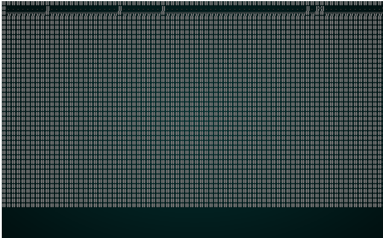
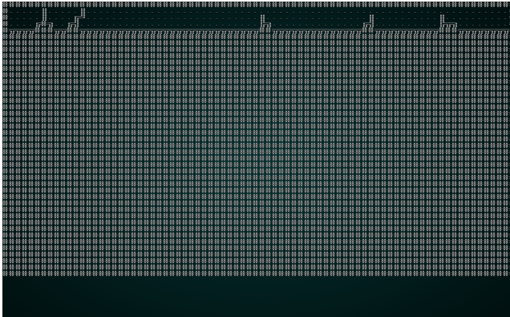

# Voronoi Hive/Cell Maps

---

***About this tutorial***

*This tutorial is free and open source, and all code uses the MIT license - so you are free to do with it as you like. My hope is that you will enjoy the tutorial, and make great games!*

*If you enjoy this and would like me to keep writing, please consider supporting [my Patreon](https://www.patreon.com/blackfuture).*

---

We've touched on Voronoi diagrams before, in our spawn placement. In this section, we'll use them to make a map. The algorithm basically subdivides the map into regions, and places walls between them. The result is a bit like a hive. You can play with the distance/adjacency algorithm to adjust the results.

## Scaffolding

We'll make scaffolding like in the previous chapters, making `voronoi.rs` with the structure `VoronoiBuilder` in it. We'll also adjust our `random_builder` function to only return `VoronoiBuilder` for now.

## Building a Voronoi Diagram

In previous usages, we've skimmed over how to actually make a Voronoi diagram - and relied on the `FastNoise` library inside `rltk`. That's all well and good, but it doesn't really show us *how* it works - and gives very limited opportunities to tweak it. So - we'll make our own.

The first step in making some Voronoi noise it to populate a set of "seeds". These are randomly chosen (but not duplicate) points on the map. We'll make the number of seeds a variable so it can be tweaked later. Here's the code:

```rust
let n_seeds = 64;
let mut voronoi_seeds : Vec<(usize, rltk::Point)> = Vec::new();

while voronoi_seeds.len() < n_seeds {
    let vx = rng.roll_dice(1, self.map.width-1);
    let vy = rng.roll_dice(1, self.map.height-1);
    let vidx = self.map.xy_idx(vx, vy);
    let candidate = (vidx, rltk::Point::new(vx, vy));
    if !voronoi_seeds.contains(&candidate) {
        voronoi_seeds.push(candidate);
    }
}
```

This makes a `vector`, each entry containing a `tuple`. Inside that tuple, we're storing an index to the map location, and a `Point` with the `x` and `y` coordinates in it (we could skip saving those and calculate from the index if we wanted, but I feel that this is clearer). Then we randomly determine a position, check to see that we haven't already rolled that location, and add it. We repeat the process until we have the desired number of seeds. `64` is quite a lot, but will give a relatively dense hive-like structure.

The next step is to determine each cell's Voronoi membership:

```rust
let mut voroni_distance = vec![(0, 0.0f32) ; n_seeds];
let mut voronoi_membership : Vec<i32> = vec![0 ; self.map.width as usize * self.map.height as usize];
for (i, vid) in voronoi_membership.iter_mut().enumerate() {
    let x = i as i32 % self.map.width;
    let y = i as i32 / self.map.width;

    for (seed, pos) in voronoi_seeds.iter().enumerate() {
        let distance = rltk::DistanceAlg::PythagorasSquared.distance2d(
            rltk::Point::new(x, y), 
            pos.1
        );
        voroni_distance[seed] = (seed, distance);
    }

    voroni_distance.sort_by(|a,b| a.1.partial_cmp(&b.1).unwrap());

    *vid = voroni_distance[0].0 as i32;
}
```

In this block of code, we:

1. Create a new `vector`, called `voronoi_distance`. It contains tuples of a `usize` and a `f32` (float), and is pre-made with `n_seeds` entries. We could make this for every iteration, but it's a lot faster to reuse the same one. We create it zeroed.
2. We create a new `voronoi_membership` vector, containing one entry per tile on the map. We set them all to 0. We'll use this to store which Voronoi cell the tile belongs to.
3. For every tile in `voronoi_membership`, we obtain an enumerator (index number) and the value. We have this mutably, so we can make changes.
    1. We calculate the `x` and `y` position of the tile from the enumerator (`i`).
    2. For each entry in the `voronoi_seeds` structure, we obtain the index (via `enumerate()`) and the position tuple.
        1. We calculate the distance from the seed to the current tile, using the `PythagorasSquared` algorithm.
        2. We set `voronoi_distance[seed]` to the seed index and the distance.
    3. We sort the `voronoi_distance` vector by the distance, so the closest seed will be the first entry.
    4. We set the tile's `vid` (Voronoi ID) to the first entry in the `voronoi_distance` list.

You can summarize that in English more easily: each tile is given membership of the Voronoi group to whom's seed it is physically closest.

Next, we use this to draw the map:

```rust
for y in 1..self.map.height-1 {
    for x in 1..self.map.width-1 {
        let mut neighbors = 0;
        let my_idx = self.map.xy_idx(x, y);
        let my_seed = voronoi_membership[my_idx];
        if voronoi_membership[self.map.xy_idx(x-1, y)] != my_seed { neighbors += 1; }
        if voronoi_membership[self.map.xy_idx(x+1, y)] != my_seed { neighbors += 1; }
        if voronoi_membership[self.map.xy_idx(x, y-1)] != my_seed { neighbors += 1; }
        if voronoi_membership[self.map.xy_idx(x, y+1)] != my_seed { neighbors += 1; }

        if neighbors < 2 {
            self.map.tiles[my_idx] = TileType::Floor;
        }
    }
    self.take_snapshot();
}  
```

In this code, we visit every tile except for the very outer edges. We count how many neighboring tiles are in a *different* Voronoi group. If the answer is 0, then it is entirely in the group: so we can place a floor. If the answer is 1, it only borders 1 other group - so we can also place a floor (to ensure we can walk around the map). Otherwise, we leave the tile as a wall.

Then we run the same culling and placement code we've used before. If you `cargo run` the project now, you will see a pleasant structure:

.

## Tweaking the Hive

There are two obvious variables to expose to the builder: the number of seeds, and the distance algorithm to use. We'll update the structure signature to include these:

```rust
#[derive(PartialEq, Copy, Clone)]
pub enum DistanceAlgorithm { Pythagoras, Manhattan, Chebyshev }

pub struct VoronoiCellBuilder {
    map : Map,
    starting_position : Position,
    depth: i32,
    history: Vec<Map>,
    noise_areas : HashMap<i32, Vec<usize>>,
    n_seeds: usize,
    distance_algorithm: DistanceAlgorithm
}
```

Then we'll update the Voronoi code to use them:

```rust
fn build(&mut self) {
    let mut rng = RandomNumberGenerator::new();

    // Make a Voronoi diagram. We'll do this the hard way to learn about the technique!
    let mut voronoi_seeds : Vec<(usize, rltk::Point)> = Vec::new();

    while voronoi_seeds.len() < self.n_seeds {
        let vx = rng.roll_dice(1, self.map.width-1);
        let vy = rng.roll_dice(1, self.map.height-1);
        let vidx = self.map.xy_idx(vx, vy);
        let candidate = (vidx, rltk::Point::new(vx, vy));
        if !voronoi_seeds.contains(&candidate) {
            voronoi_seeds.push(candidate);
        }
    }

    let mut voroni_distance = vec![(0, 0.0f32) ; self.n_seeds];
    let mut voronoi_membership : Vec<i32> = vec![0 ; self.map.width as usize * self.map.height as usize];
    for (i, vid) in voronoi_membership.iter_mut().enumerate() {
        let x = i as i32 % self.map.width;
        let y = i as i32 / self.map.width;

        for (seed, pos) in voronoi_seeds.iter().enumerate() {
            let distance;
            match self.distance_algorithm {           
                DistanceAlgorithm::Pythagoras => {
                    distance = rltk::DistanceAlg::PythagorasSquared.distance2d(
                        rltk::Point::new(x, y), 
                        pos.1
                    );
                }
                DistanceAlgorithm::Manhattan => {
                    distance = rltk::DistanceAlg::Manhattan.distance2d(
                        rltk::Point::new(x, y), 
                        pos.1
                    );
                }
                DistanceAlgorithm::Chebyshev => {
                    distance = rltk::DistanceAlg::Chebyshev.distance2d(
                        rltk::Point::new(x, y), 
                        pos.1
                    );
                }
            }
            voroni_distance[seed] = (seed, distance);
        }

        voroni_distance.sort_by(|a,b| a.1.partial_cmp(&b.1).unwrap());

        *vid = voroni_distance[0].0 as i32;
    }

    for y in 1..self.map.height-1 {
        for x in 1..self.map.width-1 {
            let mut neighbors = 0;
            let my_idx = self.map.xy_idx(x, y);
            let my_seed = voronoi_membership[my_idx];
            if voronoi_membership[self.map.xy_idx(x-1, y)] != my_seed { neighbors += 1; }
            if voronoi_membership[self.map.xy_idx(x+1, y)] != my_seed { neighbors += 1; }
            if voronoi_membership[self.map.xy_idx(x, y-1)] != my_seed { neighbors += 1; }
            if voronoi_membership[self.map.xy_idx(x, y+1)] != my_seed { neighbors += 1; }

            if neighbors < 2 {
                self.map.tiles[my_idx] = TileType::Floor;
            }
        }
        self.take_snapshot();
    }
    ...
```

As a test, lets change the constructor to use `Manhattan` distance. The results will look something like this:

.

Notice how the lines are straighter, and less organic looking. That's what Manhattan distance does: it calculates distance like a Manhattan Taxi Driver - number of rows plus number of columns, rather than a straight line distance.

## Restoring Randomness

So we'll put a couple of constructors in for each of the noise types:

```rust
pub fn pythagoras(new_depth : i32) -> VoronoiCellBuilder {
    VoronoiCellBuilder{
        map : Map::new(new_depth),
        starting_position : Position{ x: 0, y : 0 },
        depth : new_depth,
        history: Vec::new(),
        noise_areas : HashMap::new(),
        n_seeds: 64,
        distance_algorithm: DistanceAlgorithm::Pythagoras
    }
}

pub fn manhattan(new_depth : i32) -> VoronoiCellBuilder {
    VoronoiCellBuilder{
        map : Map::new(new_depth),
        starting_position : Position{ x: 0, y : 0 },
        depth : new_depth,
        history: Vec::new(),
        noise_areas : HashMap::new(),
        n_seeds: 64,
        distance_algorithm: DistanceAlgorithm::Manhattan
    }
}
```

Then we'll restore the `random_builder` to once again be random:

```rust
pub fn random_builder(new_depth: i32) -> Box<dyn MapBuilder> {
    let mut rng = rltk::RandomNumberGenerator::new();
    let builder = rng.roll_dice(1, 16);
    match builder {
        1 => Box::new(BspDungeonBuilder::new(new_depth)),
        2 => Box::new(BspInteriorBuilder::new(new_depth)),
        3 => Box::new(CellularAutomotaBuilder::new(new_depth)),
        4 => Box::new(DrunkardsWalkBuilder::open_area(new_depth)),
        5 => Box::new(DrunkardsWalkBuilder::open_halls(new_depth)),
        6 => Box::new(DrunkardsWalkBuilder::winding_passages(new_depth)),
        7 => Box::new(DrunkardsWalkBuilder::fat_passages(new_depth)),
        8 => Box::new(DrunkardsWalkBuilder::fearful_symmetry(new_depth)),
        9 => Box::new(MazeBuilder::new(new_depth)),
        10 => Box::new(DLABuilder::walk_inwards(new_depth)),
        11 => Box::new(DLABuilder::walk_outwards(new_depth)),
        12 => Box::new(DLABuilder::central_attractor(new_depth)),
        13 => Box::new(DLABuilder::insectoid(new_depth)),
        14 => Box::new(VoronoiCellBuilder::pythagoras(new_depth)),
        15 => Box::new(VoronoiCellBuilder::manhattan(new_depth)),
        _ => Box::new(SimpleMapBuilder::new(new_depth))
    }
}
```

## Wrap-Up

That's another algorithm under our belts! We really have enough to write a pretty good roguelike now, but there are still more to come!

**The source code for this chapter may be found [here](https://github.com/thebracket/rustrogueliketutorial/tree/master/chapter-32-voronoi)**


[Run this chapter's example with web assembly, in your browser (WebGL2 required)](http://bfnightly.bracketproductions.com/rustbook/wasm/chapter-32-voronoi/)
---

Copyright (C) 2019, Herbert Wolverson.

---