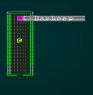
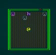
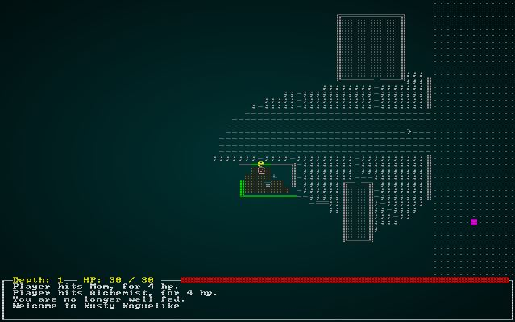
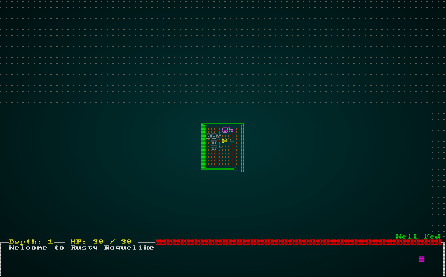
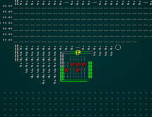

# Populating the starting town

---

***About this tutorial***

*This tutorial is free and open source, and all code uses the MIT license - so you are free to do with it as you like. My hope is that you will enjoy the tutorial, and make great games!*

*If you enjoy this and would like me to keep writing, please consider supporting [my Patreon](https://www.patreon.com/blackfuture).*

---

In the previous chapter, we built the layout of our town. In this chapter, we'll populate it with NPCs and Props. We'll introduce some new AI types to handle friendly or neutral NPCs, and begin placing merchants, townsfolk and other residents to make the town come alive. We'll also begin placing furniture and items to make the place feel less barren.

## Identifying the buildings

We're not making a real, full-sized down. There would be potentially hundreds of buildings, and the player would quickly grow bored trying to find the exit. Instead - we have 12 buildings. Looking at our design document, two of them are important:

* The Pub.
* The Temple.

That leaves 10 other locations that aren't really relevant, but we've implied that they will include vendors. Brainstorming a few vendors, it would make sense to have:

* A Blacksmith (for your weapon/armor needs).
* A clothier (for clothes, leather, and similar).
* An alchemist for potions, magical items and item identification.

So we're down to 5 more locations to fill! Lets make three of them into regular homes with residents, one into your house - complete with a nagging mother, and one into an abandoned house with a rodent issue. Rodent problems are a staple of fantasy games, and it might make for a good tutorial when we get that far.

You'll remember that we sorted our buildings by size, and decided that the largest is the pub. Let's extend that to tag each building. In `map_builders/town.rs`, look at the `build` function and we'll expand the building sorter. First, lets make an `enum` for our building types:

```rust
enum BuildingTag {
    Pub, Temple, Blacksmith, Clothier, Alchemist, PlayerHouse, Hovel, Abandoned, Unassigned
}
```

Next, we'll move our building sorter code into its own function (as part of `TownBuilder`):

```rust
fn sort_buildings(&mut self, buildings: &[(i32, i32, i32, i32)]) -> Vec<(usize, i32, BuildingTag)> 
{
    let mut building_size : Vec<(usize, i32, BuildingTag)> = Vec::new();
    for (i,building) in buildings.iter().enumerate() {
        building_size.push((
            i,
            building.2 * building.3,
            BuildingTag::Unassigned
        ));
    }
    building_size.sort_by(|a,b| b.1.cmp(&a.1));
    building_size[0].2 = BuildingTag::Pub;
    building_size[1].2 = BuildingTag::Temple;
    building_size[2].2 = BuildingTag::Blacksmith;
    building_size[3].2 = BuildingTag::Clothier;
    building_size[4].2 = BuildingTag::Alchemist;
    building_size[5].2 = BuildingTag::PlayerHouse;
    for b in building_size.iter_mut().skip(6) {
        b.2 = BuildingTag::Hovel;
    }
    let last_index = building_size.len()-1;
    building_size[last_index].2 = BuildingTag::Abandoned;
    building_size
}
```

This is the code we had before, with added `BuildingTag` entries. Once we've sorted by size, we assign the various building types - with the last one always being the abandoned house. This will ensure that we have all of our building types, and they are sorted in descending size order.

In the `build` function, replace your sort code with a call to the function - and a call to `building_factory`, which we'll write in a moment:

```rust
let building_size = self.sort_buildings(&buildings);
self.building_factory(rng, build_data, &buildings, &building_size);
```

Now we'll build a skeletal factory:

```rust
fn building_factory(&mut self, 
    rng: &mut rltk::RandomNumberGenerator, 
    build_data : &mut BuilderMap, 
    buildings: &[(i32, i32, i32, i32)], 
    building_index : &[(usize, i32, BuildingTag)]) 
{
    for (i,building) in buildings.iter().enumerate() {
        let build_type = &building_index[i].2;
        match build_type {
            _ => {}
        }
    }
}
```

## The Pub

So what would you expect to find in a pub early in the morning, when you awaken hung-over and surprised to discover that you've promised to save the world? A few ideas spring to mind:

* Other hung-over patrons, possibly asleep.
* A shady-as-can-be "lost" goods salesperson.
* A Barkeep, who probably wants you to go home.
* Tables, chairs, barrels.

We'll extend our factory function to have a `match` line to build the pub:

```rust
fn building_factory(&mut self, 
        rng: &mut rltk::RandomNumberGenerator, 
        build_data : &mut BuilderMap, 
        buildings: &[(i32, i32, i32, i32)], 
        building_index : &[(usize, i32, BuildingTag)]) 
    {
        for (i,building) in buildings.iter().enumerate() {
            let build_type = &building_index[i].2;
            match build_type {
                BuildingTag::Pub => self.build_pub(&building, build_data, rng),
                _ => {}
            }
        }
    }
```

And we'll start on the new function `build_pub`:

```rust
fn build_pub(&mut self, 
    building: &(i32, i32, i32, i32), 
    build_data : &mut BuilderMap, 
    rng: &mut rltk::RandomNumberGenerator) 
{
    // Place the player
    build_data.starting_position = Some(Position{
        x : building.0 + (building.2 / 2),
        y : building.1 + (building.3 / 2)
    });
    let player_idx = build_data.map.xy_idx(building.0 + (building.2 / 2), 
        building.1 + (building.3 / 2));

    // Place other items
    let mut to_place : Vec<&str> = vec!["Barkeep", "Shady Salesman", "Patron", "Patron", "Keg",
        "Table", "Chair", "Table", "Chair"];
    for y in building.1 .. building.1 + building.3 {
        for x in building.0 .. building.0 + building.2 {
            let idx = build_data.map.xy_idx(x, y);
            if build_data.map.tiles[idx] == TileType::WoodFloor && idx != player_idx && rng.roll_dice(1, 3)==1 && !to_place.is_empty() {
                let entity_tag = to_place[0];
                to_place.remove(0);
                build_data.spawn_list.push((idx, entity_tag.to_string()));
            }
        }
    }
}
```

Let's walk through this:

1. The function takes our building data, map information and random number generator as parameters.
2. Since we always start the player in the pub, we do that here. We can remove it from the `build` function.
3. We store the `player_idx` - we don't want to spawn anything on top of the player.
4. We make `to_place` - a list of string tags that we want in the bar. We'll worry about writing these in a bit.
5. We iterate `x` and `y` across the whole building.
    1. We calculate the map index of the building tile.
    2. If the building tile is a wooden floor, the map index is not the player map index, and a 1d3 roll comes up 1, we:
        1. Take the first tag from the `to_place` list, and remove it from the list (no duplicates unless we put it in twice).
        2. Add that tag to the `spawn_list` for the map, using the current tile tag.

That's pretty simple, and also parts are definitely generic enough to help with future buildings. If you were to run the project now, you'll see error messages such as: `WARNING: We don't know how to spawn [Barkeep]!`. That's because we haven't written them, yet. We need `spawns.json` to include all of the tags we're trying to spawn.

### Making non-hostile NPCs

Let's add an entry into `spawns.json` for our Barkeep. We'll introduce one new element - the `ai`:

```json
"mobs" : [
    {
        "name" : "Barkeep",
        "renderable": {
            "glyph" : "☺",
            "fg" : "#EE82EE",
            "bg" : "#000000",
            "order" : 1
        },
        "blocks_tile" : true,
        "stats" : {
            "max_hp" : 16,
            "hp" : 16,
            "defense" : 1,
            "power" : 4
        },
        "vision_range" : 4,
        "ai" : "bystander"
    },
```

To support the AI element, we need to open up `raws/mob_structs.rs` and edit `Mob`:

```rust
#[derive(Deserialize, Debug)]
pub struct Mob {
    pub name : String,
    pub renderable : Option<Renderable>,
    pub blocks_tile : bool,
    pub stats : MobStats,
    pub vision_range : i32,
    pub ai : String
}
```

We'll also need to add `"ai" : "melee"` to each other mob. Now open `raws/rawmaster.rs`, and we'll edit `spawn_named_mob` to support it. Replace the line `eb = eb.with(Monster{});` with:

```rust
match mob_template.ai.as_ref() {
    "melee" => eb = eb.with(Monster{}),
    "bystander" => eb = eb.with(Bystander{}),
    _ => {}
}
```

`Bystander` is a new component - so we need to open up `components.rs` and add it:

```rust
#[derive(Component, Debug, Serialize, Deserialize, Clone)]
pub struct Bystander {}
```

Then don't forget to register it in `main.rs` and `saveload_system.rs`!

If you `cargo run` now, you should see a smiling barkeep. He's resplendent in Purple (RGB `#EE82EE` from the JSON). Why purple? We're going to make vendors purple eventually (vendors are for a future chapter):



He won't react to you or *do* anything, but he's there. We'll add some behavior later in the chapter. For now, lets go ahead and add some other entities to `spawns.json` now that we support innocent bystanders (pro-tip: copy an existing entry and edit it; much easier than typing it all out again):

```json
{
    "name" : "Shady Salesman",
    "renderable": {
        "glyph" : "h",
        "fg" : "#EE82EE",
        "bg" : "#000000",
        "order" : 1
    },
    "blocks_tile" : true,
    "stats" : {
        "max_hp" : 16,
        "hp" : 16,
        "defense" : 1,
        "power" : 4
    },
    "vision_range" : 4,
    "ai" : "bystander"
},

{
    "name" : "Patron",
    "renderable": {
        "glyph" : "☺",
        "fg" : "#AAAAAA",
        "bg" : "#000000",
        "order" : 1
    },
    "blocks_tile" : true,
    "stats" : {
        "max_hp" : 16,
        "hp" : 16,
        "defense" : 1,
        "power" : 4
    },
    "vision_range" : 4,
    "ai" : "bystander"
},
```

If you `cargo run` now, the bar comes to life a bit more:



## Adding props

A pub with people and nothing for them to drink, sit on or eat at is a pretty shabby pub. I suppose we *could* argue that it's a real dive and the budget won't stretch to that, but that argument wears thin when you start adding other buildings. So we'll add some props to `spawns.json`:

```json
{
    "name" : "Keg",
    "renderable": {
        "glyph" : "φ",
        "fg" : "#AAAAAA",
        "bg" : "#000000",
        "order" : 2
    },
    "hidden" : false
},

{
    "name" : "Table",
    "renderable": {
        "glyph" : "╦",
        "fg" : "#AAAAAA",
        "bg" : "#000000",
        "order" : 2
    },
    "hidden" : false
},

{
    "name" : "Chair",
    "renderable": {
        "glyph" : "└",
        "fg" : "#AAAAAA",
        "bg" : "#000000",
        "order" : 2
    },
    "hidden" : false
}
```

If you `cargo run` now, you'll see some inert props littering the pub:


That's not amazing, but it already *feels* more alive!

## Making the temple

The temple will be similar to the pub in terms of spawning code. So similar, in fact, that we're going to break out the part of the `build_pub` function that spawns entities and make a generic function out of it. Here's the new function:

```rust
fn random_building_spawn(
    &mut self, 
    building: &(i32, i32, i32, i32), 
    build_data : &mut BuilderMap, 
    rng: &mut rltk::RandomNumberGenerator,
    to_place : &mut Vec<&str>,
    player_idx : usize)
{
    for y in building.1 .. building.1 + building.3 {
        for x in building.0 .. building.0 + building.2 {
            let idx = build_data.map.xy_idx(x, y);
            if build_data.map.tiles[idx] == TileType::WoodFloor && idx != player_idx && rng.roll_dice(1, 3)==1 && !to_place.is_empty() {
                let entity_tag = to_place[0];
                to_place.remove(0);
                build_data.spawn_list.push((idx, entity_tag.to_string()));
            }
        }
    }
}
```

We'll replace our call to that code in `build_pub` with:

```rust
// Place other items
let mut to_place : Vec<&str> = vec!["Barkeep", "Shady Salesman", "Patron", "Patron", "Keg",
    "Table", "Chair", "Table", "Chair"];
self.random_building_spawn(building, build_data, rng, &mut to_place, player_idx);
```

With that in place, let's think about what you might find in a temple:

* Priests
* Parishioners
* Chairs
* Candles

Now we'll extend our factory to include temples:

```rust
match build_type {
    BuildingTag::Pub => self.build_pub(&building, build_data, rng),
    BuildingTag::Temple => self.build_temple(&building, build_data, rng),
    _ => {}
}
```

And our `build_temple` function can be very simple:

```rust
fn build_temple(&mut self, 
    building: &(i32, i32, i32, i32), 
    build_data : &mut BuilderMap, 
    rng: &mut rltk::RandomNumberGenerator) 
{
    // Place items
    let mut to_place : Vec<&str> = vec!["Priest", "Parishioner", "Parishioner", "Chair", "Chair", "Candle", "Candle"];
    self.random_building_spawn(building, build_data, rng, &mut to_place, 0);
}
```

So, with that in place - we still have to add Priests, Parishioners, and Candles to the `spawns.json` list. The Priest and Parishioner go in the `mobs` section, and are basically the same as the Barkeep:

```json
{
    "name" : "Priest",
    "renderable": {
        "glyph" : "☺",
        "fg" : "#EE82EE",
        "bg" : "#000000",
        "order" : 1
    },
    "blocks_tile" : true,
    "stats" : {
        "max_hp" : 16,
        "hp" : 16,
        "defense" : 1,
        "power" : 4
    },
    "vision_range" : 4,
    "ai" : "bystander"
},

{
    "name" : "Parishioner",
    "renderable": {
        "glyph" : "☺",
        "fg" : "#AAAAAA",
        "bg" : "#000000",
        "order" : 1
    },
    "blocks_tile" : true,
    "stats" : {
        "max_hp" : 16,
        "hp" : 16,
        "defense" : 1,
        "power" : 4
    },
    "vision_range" : 4,
    "ai" : "bystander"
},
```

Likewise, for now at least - candles are just another prop:

```json
{
    "name" : "Candle",
    "renderable": {
        "glyph" : "Ä",
        "fg" : "#FFA500",
        "bg" : "#000000",
        "order" : 2
    },
    "hidden" : false
}
```

If you `cargo run` now, you can run around and find a temple:


## Build other buildings

We've done most of the hard work now, so we are just filling in the blanks. Lets expand our `match` in our builder to include the various types other than the Abandoned House:

```rust
let build_type = &building_index[i].2;
match build_type {
    BuildingTag::Pub => self.build_pub(&building, build_data, rng),
    BuildingTag::Temple => self.build_temple(&building, build_data, rng),
    BuildingTag::Blacksmith => self.build_smith(&building, build_data, rng),
    BuildingTag::Clothier => self.build_clothier(&building, build_data, rng),
    BuildingTag::Alchemist => self.build_alchemist(&building, build_data, rng),
    BuildingTag::PlayerHouse => self.build_my_house(&building, build_data, rng),
    BuildingTag::Hovel => self.build_hovel(&building, build_data, rng),
    _ => {}
}
```

We're lumping these in together because they are basically the same function! Here's the body of each of them:

```rust
fn build_smith(&mut self, 
    building: &(i32, i32, i32, i32), 
    build_data : &mut BuilderMap, 
    rng: &mut rltk::RandomNumberGenerator) 
{
    // Place items
    let mut to_place : Vec<&str> = vec!["Blacksmith", "Anvil", "Water Trough", "Weapon Rack", "Armor Stand"];
    self.random_building_spawn(building, build_data, rng, &mut to_place, 0);
}

fn build_clothier(&mut self, 
    building: &(i32, i32, i32, i32), 
    build_data : &mut BuilderMap, 
    rng: &mut rltk::RandomNumberGenerator) 
{
    // Place items
    let mut to_place : Vec<&str> = vec!["Clothier", "Cabinet", "Table", "Loom", "Hide Rack"];
    self.random_building_spawn(building, build_data, rng, &mut to_place, 0);
}

fn build_alchemist(&mut self, 
    building: &(i32, i32, i32, i32), 
    build_data : &mut BuilderMap, 
    rng: &mut rltk::RandomNumberGenerator) 
{
    // Place items
    let mut to_place : Vec<&str> = vec!["Alchemist", "Chemistry Set", "Dead Thing", "Chair", "Table"];
    self.random_building_spawn(building, build_data, rng, &mut to_place, 0);
}

fn build_my_house(&mut self, 
    building: &(i32, i32, i32, i32), 
    build_data : &mut BuilderMap, 
    rng: &mut rltk::RandomNumberGenerator) 
{
    // Place items
    let mut to_place : Vec<&str> = vec!["Mom", "Bed", "Cabinet", "Chair", "Table"];
    self.random_building_spawn(building, build_data, rng, &mut to_place, 0);
}

fn build_hovel(&mut self, 
    building: &(i32, i32, i32, i32), 
    build_data : &mut BuilderMap, 
    rng: &mut rltk::RandomNumberGenerator) 
{
    // Place items
    let mut to_place : Vec<&str> = vec!["Peasant", "Bed", "Chair", "Table"];
    self.random_building_spawn(building, build_data, rng, &mut to_place, 0);
}
```

As you can see - these are basically passing spawn lists to the building spawner, rather than doing anything too fancy. We've created quite a lot of new entities here! I tried to come up with things you might find in each location:

* The *smith* has of course got a Blacksmith. He likes to be around Anvils, Water Troughs, Weapon Racks, and Armor Stands.
* The *clothier* has a Clothier, and a Cabinet, a Table, a Loom and a Hide Rack.
* The *alchemist* has an Alchemist, a Chemistry Set, a Dead Thing (why not, right?), a Chair and a Table.
* *My House* features Mom (the characters mother!), a bed, a cabinet, a chair and a table.
* *Hovels* feature a Peasant, a bed, a chair and a table.

So we'll need to support these in `spawns.json`:

```json
{
    "name" : "Blacksmith",
    "renderable": {
        "glyph" : "☺",
        "fg" : "#EE82EE",
        "bg" : "#000000",
        "order" : 1
    },
    "blocks_tile" : true,
    "stats" : {
        "max_hp" : 16,
        "hp" : 16,
        "defense" : 1,
        "power" : 4
    },
    "vision_range" : 4,
    "ai" : "bystander"
},

{
    "name" : "Clothier",
    "renderable": {
        "glyph" : "☺",
        "fg" : "#EE82EE",
        "bg" : "#000000",
        "order" : 1
    },
    "blocks_tile" : true,
    "stats" : {
        "max_hp" : 16,
        "hp" : 16,
        "defense" : 1,
        "power" : 4
    },
    "vision_range" : 4,
    "ai" : "bystander"
},

{
    "name" : "Alchemist",
    "renderable": {
        "glyph" : "☺",
        "fg" : "#EE82EE",
        "bg" : "#000000",
        "order" : 1
    },
    "blocks_tile" : true,
    "stats" : {
        "max_hp" : 16,
        "hp" : 16,
        "defense" : 1,
        "power" : 4
    },
    "vision_range" : 4,
    "ai" : "bystander"
},

{
    "name" : "Mom",
    "renderable": {
        "glyph" : "☺",
        "fg" : "#FFAAAA",
        "bg" : "#000000",
        "order" : 1
    },
    "blocks_tile" : true,
    "stats" : {
        "max_hp" : 16,
        "hp" : 16,
        "defense" : 1,
        "power" : 4
    },
    "vision_range" : 4,
    "ai" : "bystander"
},

{
    "name" : "Peasant",
    "renderable": {
        "glyph" : "☺",
        "fg" : "#999999",
        "bg" : "#000000",
        "order" : 1
    },
    "blocks_tile" : true,
    "stats" : {
        "max_hp" : 16,
        "hp" : 16,
        "defense" : 1,
        "power" : 4
    },
    "vision_range" : 4,
    "ai" : "bystander"
},
```

And in the props section:

```json
{
    "name" : "Anvil",
    "renderable": {
        "glyph" : "╔",
        "fg" : "#AAAAAA",
        "bg" : "#000000",
        "order" : 2
    },
    "hidden" : false
},

{
    "name" : "Water Trough",
    "renderable": {
        "glyph" : "•",
        "fg" : "#5555FF",
        "bg" : "#000000",
        "order" : 2
    },
    "hidden" : false
},

{
    "name" : "Weapon Rack",
    "renderable": {
        "glyph" : "π",
        "fg" : "#FFD700",
        "bg" : "#000000",
        "order" : 2
    },
    "hidden" : false
},

{
    "name" : "Armor Stand",
    "renderable": {
        "glyph" : "⌠",
        "fg" : "#FFFFFF",
        "bg" : "#000000",
        "order" : 2
    },
    "hidden" : false
},

{
    "name" : "Chemistry Set",
    "renderable": {
        "glyph" : "δ",
        "fg" : "#00FFFF",
        "bg" : "#000000",
        "order" : 2
    },
    "hidden" : false
},

{
    "name" : "Dead Thing",
    "renderable": {
        "glyph" : "☻",
        "fg" : "#AA0000",
        "bg" : "#000000",
        "order" : 2
    },
    "hidden" : false
},

{
    "name" : "Cabinet",
    "renderable": {
        "glyph" : "∩",
        "fg" : "#805A46",
        "bg" : "#000000",
        "order" : 2
    },
    "hidden" : false
},

{
    "name" : "Bed",
    "renderable": {
        "glyph" : "8",
        "fg" : "#805A46",
        "bg" : "#000000",
        "order" : 2
    },
    "hidden" : false
},

{
    "name" : "Loom",
    "renderable": {
        "glyph" : "≡",
        "fg" : "#805A46",
        "bg" : "#000000",
        "order" : 2
    },
    "hidden" : false
},

{
    "name" : "Hide Rack",
    "renderable": {
        "glyph" : "π",
        "fg" : "#805A46",
        "bg" : "#000000",
        "order" : 2
    },
    "hidden" : false
}
```


If you `cargo run` now, you can run around and find largely populated rooms:



Hopefully, you also spot the bug: the player beat his/her Mom (and the alchemist)! We don't really want to encourage that type of behavior! So in the next segment, we'll work on some neutral AI and player movement behavior with NPCs.

## Neutral AI/Movement

There are two issues present with our current "bystander" handling: bystanders just stand there like lumps (blocking your movement, even!), and there is no way to get around them without slaughtering them. I'd like to think our hero won't start his/her adventure by murdering their Mom - so lets rectify the situation!

### Trading Places

Currently, when you "bump" into a tile containing anything with combat stats - you launch an attack. This is provided in `player.rs`, the `try_move_player` function:

```rust
let target = combat_stats.get(*potential_target);
if let Some(_target) = target {
    wants_to_melee.insert(entity, WantsToMelee{ target: *potential_target }).expect("Add target failed");
    return;
}
```

We need to extend this to not only attack, but swap places with the NPC when we bump into them. This way, they *can't* block your movement - but you also can't murder your mother! So first, we need to gain access to the `Bystanders` component store, and make a vector in which we will store our intent to move NPCs (we can't just access them in-loop; the borrow checker will throw a fit, unfortunately):

```rust
let bystanders = ecs.read_storage::<Bystander>();

let mut swap_entities : Vec<(Entity, i32, i32)> = Vec::new();
```

So in `swap_entities`, we're storing the entity to move and their x/y destination coordinates. Now we adjust our main loop to check to see if a target is a bystander, add them to the swap list and move anyway if they are. We also make attacking conditional upon them *not* being a bystander:

```rust
let bystander = bystanders.get(*potential_target);
if bystander.is_some() {
    // Note that we want to move the bystander
    swap_entities.push((*potential_target, pos.x, pos.y));

    // Move the player
    pos.x = min(map.width-1 , max(0, pos.x + delta_x));
    pos.y = min(map.height-1, max(0, pos.y + delta_y));
    entity_moved.insert(entity, EntityMoved{}).expect("Unable to insert marker");

    viewshed.dirty = true;
    let mut ppos = ecs.write_resource::<Point>();
    ppos.x = pos.x;
    ppos.y = pos.y;
} else {
    let target = combat_stats.get(*potential_target);
    if let Some(_target) = target {
        wants_to_melee.insert(entity, WantsToMelee{ target: *potential_target }).expect("Add target failed");
        return;
    }
}
```

Finally, at the very end of the function we iterate through `swap_entities` and apply the movement:

```rust
for m in swap_entities.iter() {
    let their_pos = positions.get_mut(m.0);
    if let Some(their_pos) = their_pos {
        their_pos.x = m.1;
        their_pos.y = m.2;
    }
}
```

If you `cargo run` now, you can no longer murder all of the NPCs; bumping into them swaps your positions:



## The Abandoned House

Lastly (for this chapter), we need to populate the abandoned house. We decided that it was going to contain a massive rodent problem, since rodents of unusual size are a significant problem for low-level adventurers! We'll add another match line to our building factory matcher:

```rust
BuildingTag::Abandoned => self.build_abandoned_house(&building, build_data, rng),
```

And here's the function to about half-fill the house with rodents:

```rust
fn build_abandoned_house(&mut self, 
    building: &(i32, i32, i32, i32), 
    build_data : &mut BuilderMap, 
    rng: &mut rltk::RandomNumberGenerator) 
{
    for y in building.1 .. building.1 + building.3 {
        for x in building.0 .. building.0 + building.2 {
            let idx = build_data.map.xy_idx(x, y);
            if build_data.map.tiles[idx] == TileType::WoodFloor && idx != 0 && rng.roll_dice(1, 2)==1 {
                build_data.spawn_list.push((idx, "Rat".to_string()));
            }
        }
    }
}
```

Lastly, we need to add `Rat` to the mob list in `spawns.json`:

```json
{
    "name" : "Rat",
    "renderable": {
        "glyph" : "r",
        "fg" : "#FF0000",
        "bg" : "#000000",
        "order" : 1
    },
    "blocks_tile" : true,
    "stats" : {
        "max_hp" : 2,
        "hp" : 2,
        "defense" : 1,
        "power" : 3
    },
    "vision_range" : 8,
    "ai" : "melee"
},
```

If you `cargo run` now, and hunt around for the abandoned house - you'll find it full of hostile rats:



## Wrap-Up

In this chapter, we've added a bunch of props and bystanders to the town - as well as a house full of angry rats. That makes it feel a lot more alive. It's by no means done yet, but it's already starting to feel like the opening scene of a fantasy game. In the next chapter, we're going to make some AI adjustments to make it feel more alive - and add some bystanders who aren't conveniently hanging around inside buildings.

**The source code for this chapter may be found [here](https://github.com/thebracket/rustrogueliketutorial/tree/master/chapter-48-town2)**


[Run this chapter's example with web assembly, in your browser (WebGL2 required)](https://bfnightly.bracketproductions.com/rustbook/wasm/chapter-48-town2)
---

Copyright (C) 2019, Herbert Wolverson.

---