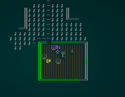
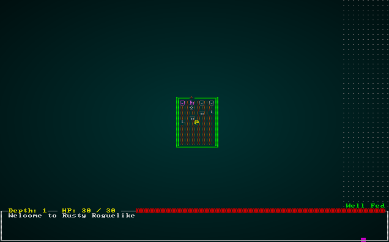
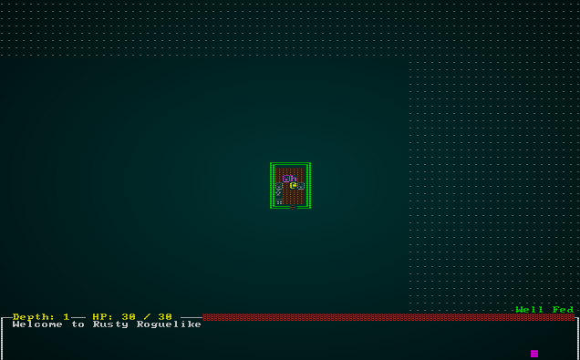

# Bringing NPCs to Life

---

***About this tutorial***

*This tutorial is free and open source, and all code uses the MIT license - so you are free to do with it as you like. My hope is that you will enjoy the tutorial, and make great games!*

*If you enjoy this and would like me to keep writing, please consider supporting [my Patreon](https://www.patreon.com/blackfuture).*

---

I'd like to suggest dark incantations and candles to breathe life into NPCs, but in reality - it's more code. We don't want our bystanders to stand around, dumb as rocks anymore. They don't have to behave particularly sensibly, but it would be good if they at least roam around a bit (other than vendors, that gets annoying - "where did the blacksmith go?") and tell you about their day.

## New components - dividing vendors from bystanders

First, we're going to make a new component - the `Vendor`. In `components.rs`, add the following component type:

```rust
#[derive(Component, Debug, Serialize, Deserialize, Clone)]
pub struct Vendor {}
```

*Don't forget to register it in `main.rs` and `saveload_system.rs`!*

Now we'll adjust our raw files (`spawns.json`); all of the merchants who feature `"ai" : "bystander"` need to be changed to `"ai" : "vendor"`. So we'll change it for our Barkeep, Alchemist, Clothier, Blacksmith and Shady Salesman.

Next, we adjust our `raws/rawmaster.rs`'s function `spawn_named_mob` to also spawn vendors:

```rust
match mob_template.ai.as_ref() {
    "melee" => eb = eb.with(Monster{}),
    "bystander" => eb = eb.with(Bystander{}),
    "vendor" => eb = eb.with(Vendor{}),
    _ => {}
}
```

Finally, we'll adjust the `try_move_player` function in `player.rs` to also not attack vendors:

```rust
...
let vendors = ecs.read_storage::<Vendor>();

let mut swap_entities : Vec<(Entity, i32, i32)> = Vec::new();

for (entity, _player, pos, viewshed) in (&entities, &players, &mut positions, &mut viewsheds).join() {
    if pos.x + delta_x < 1 || pos.x + delta_x > map.width-1 || pos.y + delta_y < 1 || pos.y + delta_y > map.height-1 { return RunState::AwaitingInput; }
    let destination_idx = map.xy_idx(pos.x + delta_x, pos.y + delta_y);

    for potential_target in map.tile_content[destination_idx].iter() {
        let bystander = bystanders.get(*potential_target);
        let vendor = vendors.get(*potential_target);
        if bystander.is_some() || vendor.is_some() {
...
```

## A System for Moving Bystanders

We want bystanders to wander around the town. We won't have them open doors, to keep things consistent (so when you enter the pub, you can expect patrons - and they won't have wandered off to fight rats!). Make a new file, `bystander_ai_system.rs` and paste the following into it:

```rust
use specs::prelude::*;
use super::{Viewshed, Bystander, Map, Position, RunState, EntityMoved};

pub struct BystanderAI {}

impl<'a> System<'a> for BystanderAI {
    #[allow(clippy::type_complexity)]
    type SystemData = ( WriteExpect<'a, Map>,
                        ReadExpect<'a, RunState>,
                        Entities<'a>,
                        WriteStorage<'a, Viewshed>, 
                        ReadStorage<'a, Bystander>,
                        WriteStorage<'a, Position>,
                        WriteStorage<'a, EntityMoved>,
                        WriteExpect<'a, rltk::RandomNumberGenerator>);

    fn run(&mut self, data : Self::SystemData) {
        let (mut map, runstate, entities, mut viewshed, bystander, mut position,
            mut entity_moved, mut rng) = data;

        if *runstate != RunState::MonsterTurn { return; }

        for (entity, mut viewshed, _bystander, mut pos) in (&entities, &mut viewshed, &bystander, &mut position).join() {
            // Try to move randomly
            let mut x = pos.x;
            let mut y = pos.y;
            let move_roll = rng.roll_dice(1, 5);
            match move_roll {
                1 => x -= 1,
                2 => x += 1,
                3 => y -= 1,
                4 => y += 1,
                _ => {}
            }

            if x > 0 && x < map.width-1 && y > 0 && y < map.height-1 {
                let dest_idx = map.xy_idx(x, y);
                if !map.blocked[dest_idx] {
                    let idx = map.xy_idx(pos.x, pos.y);
                    map.blocked[idx] = false;
                    pos.x = x;
                    pos.y = y;
                    entity_moved.insert(entity, EntityMoved{}).expect("Unable to insert marker");
                    map.blocked[dest_idx] = true;
                    viewshed.dirty = true;
                }
            }
        }
    }
}
```

If you remember from the systems we've made before, the first part is boilerplate telling the ECS what resources we want to access. We check to see if it is the monster's turn (really, NPCs are monsters in this setup); if it isn't, we bail out. Then we roll a dice for a random direction, see if we can go that way - and move if we can. It's pretty simple!

In `main.rs`, we need to tell it to use the new module:

```rust
pub mod bystander_ai_system;
```

We also need to add the system to our list of systems to run:

```rust
impl State {
    fn run_systems(&mut self) {
        let mut vis = VisibilitySystem{};
        vis.run_now(&self.ecs);
        let mut mob = MonsterAI{};
        mob.run_now(&self.ecs);
        let mut mapindex = MapIndexingSystem{};
        mapindex.run_now(&self.ecs);
        let mut bystander = bystander_ai_system::BystanderAI{};
        bystander.run_now(&self.ecs);
        let mut triggers = trigger_system::TriggerSystem{};
        triggers.run_now(&self.ecs);
        let mut melee = MeleeCombatSystem{};
        melee.run_now(&self.ecs);
        let mut damage = DamageSystem{};
        damage.run_now(&self.ecs);
        let mut pickup = ItemCollectionSystem{};
        pickup.run_now(&self.ecs);
        let mut itemuse = ItemUseSystem{};
        itemuse.run_now(&self.ecs);
        let mut drop_items = ItemDropSystem{};
        drop_items.run_now(&self.ecs);
        let mut item_remove = ItemRemoveSystem{};
        item_remove.run_now(&self.ecs);
        let mut hunger = hunger_system::HungerSystem{};
        hunger.run_now(&self.ecs);
        let mut particles = particle_system::ParticleSpawnSystem{};
        particles.run_now(&self.ecs);

        self.ecs.maintain();
    }
}
```

If you `cargo run` the project now, you can watch NPCs bumbling around randomly. Having them move goes a *long* way to not making it feel like a town of statues!



## Quipping NPCs

To further brings things to life, lets allow NPCs to "quip" when they spot you. In `spawns.json`, lets add some quips to the `Patron` (bar patron):

```json
{
    "name" : "Patron",
    "renderable": {
        "glyph" : "☺",
        "fg" : "#AAAAAA",
        "bg" : "#000000",
        "order" : 1
    },
    "blocks_tile" : true,
    "stats" : {
        "max_hp" : 16,
        "hp" : 16,
        "defense" : 1,
        "power" : 4
    },
    "vision_range" : 4,
    "ai" : "bystander",
    "quips" : [ "Quiet down, it's too early!", "Oh my, I drank too much.", "Still saving the world, eh?" ]
},
```

We need to modify `raws/mob_structs.rs` to handle loading this data:

```rust
#[derive(Deserialize, Debug)]
pub struct Mob {
    pub name : String,
    pub renderable : Option<Renderable>,
    pub blocks_tile : bool,
    pub stats : MobStats,
    pub vision_range : i32,
    pub ai : String,
    pub quips : Option<Vec<String>>
}
```

We also need to create a component to hold available quips. In `components.rs`:

```rust
#[derive(Component, Debug, Serialize, Deserialize, Clone)]
pub struct Quips {
    pub available : Vec<String>
}
```

*Don't forget to register it in `main.rs` and `saveload_system.rs`!*

We need to update `rawmaster.rs`'s function `spawn_named_mob` to be able to add this component:

```rust
if let Some(quips) = &mob_template.quips {
    eb = eb.with(Quips{
        available: quips.clone()
    });
}
```

Lastly, we'll add the ability to enter these quips into the game log when they spot you. In `bystander_ai_system.rs`. First, extend the available set of data for the system as follows:

```rust
...
WriteExpect<'a, rltk::RandomNumberGenerator>,
                        ReadExpect<'a, Point>,
                        WriteExpect<'a, GameLog>,
                        WriteStorage<'a, Quips>,
                        ReadStorage<'a, Name>);

    fn run(&mut self, data : Self::SystemData) {
        let (mut map, runstate, entities, mut viewshed, bystander, mut position,
            mut entity_moved, mut rng, player_pos, mut gamelog, mut quips, names) = data;
...
```

You may remember this: it gets read-only access the the `Point` resource we store containing the player's location, write access to the `GameLog`, and access to the component stores for `Quips` and `Name`. Now, we add the quipping to the function body:

```rust
...
for (entity, mut viewshed,_bystander,mut pos) in (&entities, &mut viewshed, &bystander, &mut position).join() {
    // Possibly quip
    let quip = quips.get_mut(entity);
    if let Some(quip) = quip {
        if !quip.available.is_empty() && viewshed.visible_tiles.contains(&player_pos) && rng.roll_dice(1,6)==1 {
            let name = names.get(entity);
            let quip_index = if quip.available.len() == 1 { 0 } else { (rng.roll_dice(1, quip.available.len() as i32)-1) as usize };
            gamelog.entries.push(
                format!("{} says \"{}\"", name.unwrap().name, quip.available[quip_index])
            );
            quip.available.remove(quip_index);
        }                
    }

    // Try to move randomly
...
```

We can step through what it's doing:

1. It asks for a component from the `quips` store. This will be an `Option` - either `None` (nothing to say) or `Some` - containing the quips.
2. If there *are* some quips...
3. If the list of available quips isn't empty, the viewshed contains the player's tile, and 1d6 roll comes up 1...
4. We look up the entity's name,
5. Randomly pick an entry in the `available` list from `quip`.
6. Log a string as `Name` says `Quip`.
7. Remove the quip from that entity's available quip list - they won't keep repeating themselves.

If you run the game now, you'll find that patrons are willing to comment on life in general:



We'll find that this can be used in other parts of the game, such as having guards shouting alerts, or goblins saying appropriately "Goblinesque" things. For brevity, we won't list every quip in the game here. [Check out the source](https://github.com/thebracket/rustrogueliketutorial/tree/master/chapter-49-town3/raws/spawns.json) to see what we've added.

This sort of "fluff" goes a long way towards making a world feel alive, even if it doesn't really add to gameplay in a meaningful fashion. Since the town is the first area the player sees, it's good to have fluff.

## Outdoor NPCs

All of the NPCs in the town so far have been conveniently located inside buildings. It isn't very realistic, even in terrible weather (which we don't have!); so we should look at spawning a few outdoor NPCs.

Open up `map_builders/town.rs` and we'll make two new functions; here's the calls to them in the main `build` function:

```rust
self.spawn_dockers(build_data, rng);
self.spawn_townsfolk(build_data, rng, &mut available_building_tiles);
```

The `spawn_dockers` function looks for bridge tiles, and places various people on them:

```rust
fn spawn_dockers(&mut self, build_data : &mut BuilderMap, rng: &mut rltk::RandomNumberGenerator) {
    for (idx, tt) in build_data.map.tiles.iter().enumerate() {
        if *tt == TileType::Bridge && rng.roll_dice(1, 6)==1 {
            let roll = rng.roll_dice(1, 3);
            match roll {
                1 => build_data.spawn_list.push((idx, "Dock Worker".to_string())),
                2 => build_data.spawn_list.push((idx, "Wannabe Pirate".to_string())),
                _ => build_data.spawn_list.push((idx, "Fisher".to_string())),
            }
        }
    }
}
```
This is simple enough: for each tile on the map, retrieve its index and type. If its a bridge, and a 1d6 comes up a `1` - spawn someone. We randomly pick between Dock Workers, Wannabe Pirates and Fisherfolk.

`spawn_townsfolk` is pretty simple, too:

```rust
fn spawn_townsfolk(&mut self, 
    build_data : &mut BuilderMap, 
    rng: &mut rltk::RandomNumberGenerator, 
    available_building_tiles : &mut HashSet<usize>) 
{
    for idx in available_building_tiles.iter() {
        if rng.roll_dice(1, 10)==1 {
            let roll = rng.roll_dice(1, 4);
            match roll {
                1 => build_data.spawn_list.push((*idx, "Peasant".to_string())),
                2 => build_data.spawn_list.push((*idx, "Drunk".to_string())),
                3 => build_data.spawn_list.push((*idx, "Dock Worker".to_string())),
                _ => build_data.spawn_list.push((*idx, "Fisher".to_string())),
            }
        }
    }
}
```

This iterates all the *remaining* `availble_building_tiles`; these are tiles we *know* won't be inside of a building, because we removed them when we placed buildings! So each spot is guaranteed to be outdoors, and in town. For each tile, we roll 1d10 - and if its a 1, we spawn one of a Peasant, a Drunk, a Dock Worker or a Fisher.

Lastly, we add these folk to our `spawns.json` file:

```json
{
    "name" : "Dock Worker",
    "renderable": {
        "glyph" : "☺",
        "fg" : "#999999",
        "bg" : "#000000",
        "order" : 1
    },
    "blocks_tile" : true,
    "stats" : {
        "max_hp" : 16,
        "hp" : 16,
        "defense" : 1,
        "power" : 4
    },
    "vision_range" : 4,
    "ai" : "bystander",
    "quips" : [ "Lovely day, eh?", "Nice weather", "Hello" ]
},

{
    "name" : "Fisher",
    "renderable": {
        "glyph" : "☺",
        "fg" : "#999999",
        "bg" : "#000000",
        "order" : 1
    },
    "blocks_tile" : true,
    "stats" : {
        "max_hp" : 16,
        "hp" : 16,
        "defense" : 1,
        "power" : 4
    },
    "vision_range" : 4,
    "ai" : "bystander",
    "quips" : [ "They're biting today!", "I caught something, but it wasn't a fish!", "Looks like rain" ]
},

{
    "name" : "Wannabe Pirate",
    "renderable": {
        "glyph" : "☺",
        "fg" : "#aa9999",
        "bg" : "#000000",
        "order" : 1
    },
    "blocks_tile" : true,
    "stats" : {
        "max_hp" : 16,
        "hp" : 16,
        "defense" : 1,
        "power" : 4
    },
    "vision_range" : 4,
    "ai" : "bystander",
    "quips" : [ "Arrr", "Grog!", "Booze!" ]
},

{
    "name" : "Drunk",
    "renderable": {
        "glyph" : "☺",
        "fg" : "#aa9999",
        "bg" : "#000000",
        "order" : 1
    },
    "blocks_tile" : true,
    "stats" : {
        "max_hp" : 16,
        "hp" : 16,
        "defense" : 1,
        "power" : 4
    },
    "vision_range" : 4,
    "ai" : "bystander",
    "quips" : [ "Hic", "Need... more... booze!", "Spare a copper?" ]
},
```

If you `cargo run` now, you'll see a town teeming with life:



## Wrap-Up

This chapter has really brought our town to life. There's always room for improvement, but it's good enough for a starting map! The next chapter will change gear, and start adding *stats* to the game.

**The source code for this chapter may be found [here](https://github.com/thebracket/rustrogueliketutorial/tree/master/chapter-49-town3)**


[Run this chapter's example with web assembly, in your browser (WebGL2 required)](http://bfnightly.bracketproductions.com/rustbook/wasm/chapter-49-town3)
---

Copyright (C) 2019, Herbert Wolverson.

---