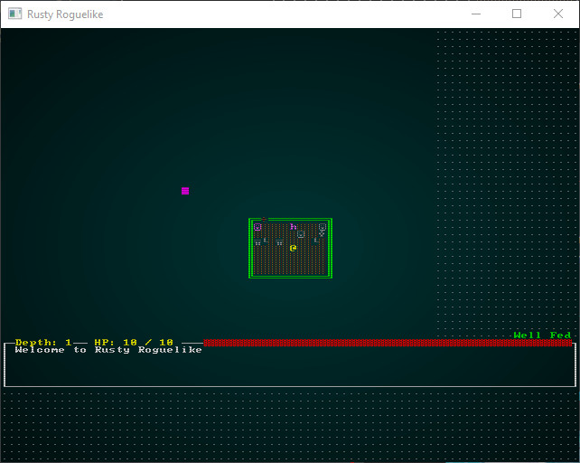
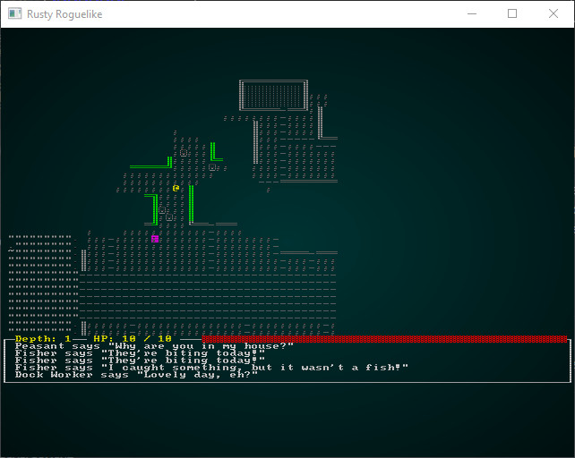
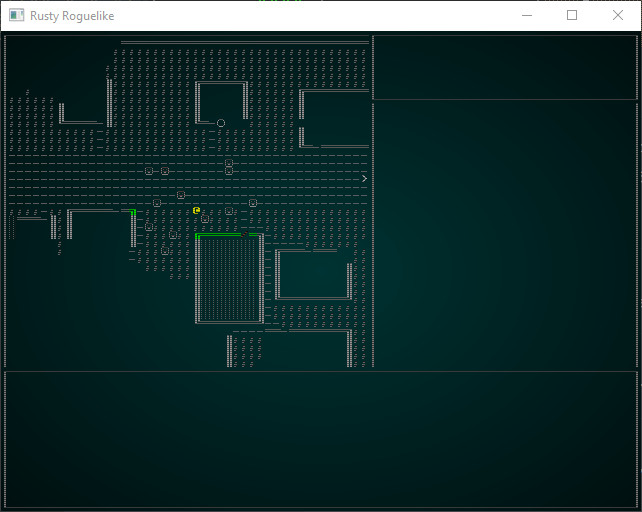
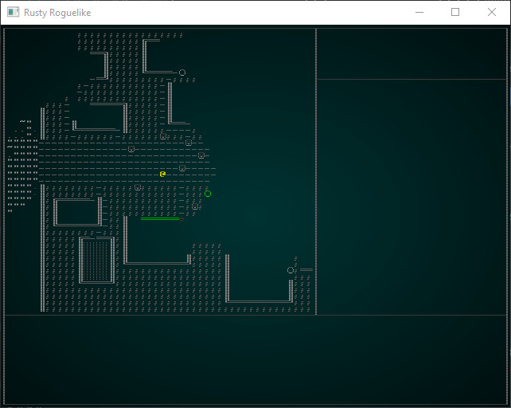
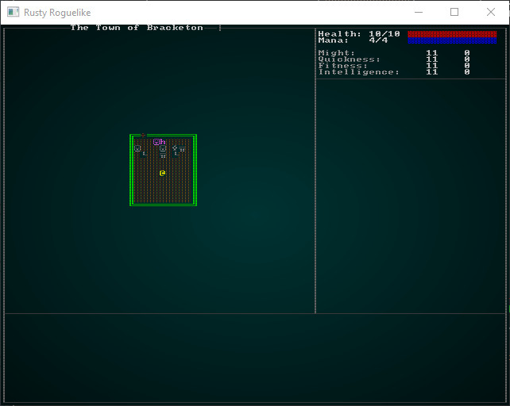
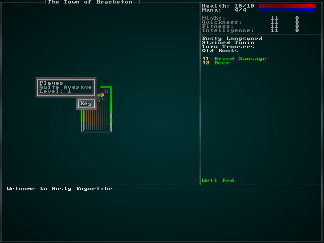
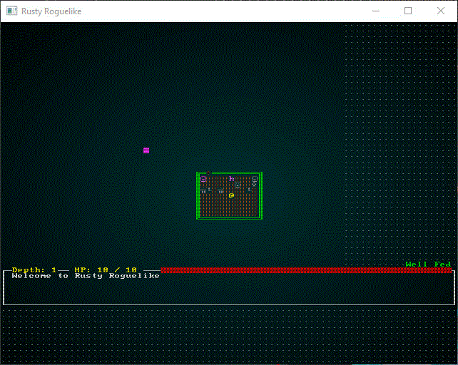

# User Interface

---

***About this tutorial***

*This tutorial is free and open source, and all code uses the MIT license - so you are free to do with it as you like. My hope is that you will enjoy the tutorial, and make great games!*

*If you enjoy this and would like me to keep writing, please consider supporting [my Patreon](https://www.patreon.com/blackfuture).*

---

Along with the town, the first thing your player sees will be your user interface. We've chugged along with a reasonably decent one for a while, but not a *great* one. Ideally, a user interface should make the game approachable to new players - while still offering enough depth for returning ones. It should support keyboard and mouse input (I know many long-time roguelike players hate the mouse; but many newer ones love it), and offer feedback as to what the symbol soup actually *means*. Symbols are a great way to represent the world, but there is a learning curve while your brain comes to associate `g` with a goblin and imagines the scary little blighter.

[Cogmind](https://www.gridsagegames.com/cogmind/) is an inspiration for ASCII (and simple tile) user interfaces. If you haven't played it, I wholeheartedly recommend giving it a look. Also, in a conversation with the creator of [Red Blob Games](https://www.redblobgames.com/), he gave some very insightful commentary on the importance of a good UI: building a UI up-front helps you realize if you can *show* the player what you are making, and can give a really good "feel" for what you are building. So once you are passed initial prototyping, building a user interface can act as a guide for the rest. He's a very wise man, so we'll take his advice!

## Prototyping a User Interface

I like to sketch out UI in [Rex Paint](https://www.gridsagegames.com/rexpaint/). Here's what I first came up with for the tutorial game:


This isn't a bad start, as far as ASCII user interfaces go. Some pertinent notes:

* We've expanded the terminal to `80x60`, which is a pretty common resolution for these games (Cogmind defaults to it).
*  We've *shrunk* the amount of screen devoted to the map, so as to show you more pertinent information on the screen at once; it's actually `50x48`. 
* The bottom panel is the log, which I colored in and gave some silly fake text just to make it clear what goes there. We'll definitely want to improve our logging experience to help immerse the player. 
* The top-right shows some important information: your health and mana, both numerically and with bars. Below that, we're showing your attributes - and highlighting the ones that are improved in some way (we didn't say how!). 
* The next panel down lists your equipped inventory.
* Below that, we show your *consumables* - complete with a hot-key (shift + number) to activate them.
* Below that, we're showing an example spell - that's not implemented yet, but the idea stands.
* At the bottom of the right panel, we're listing *status effects*. The design document says that you start with a hangover, so we've listed it (even if it isn't written yet). You also start *well fed*, so we'll show that, too.

## Changing the console size

In `main.rs`, the first thing our `main` function does is to bootstrap RLTK. We specify resolution and window title here. So we'll update it to match what we want:

```rust
let mut context = Rltk::init_simple8x8(80, 60, "Rusty Roguelike", "resources");
```

If you `cargo run` now, you'll see a bigger console - and nothing making use of the extra space!



We'll worry about fixing the main menu later. Let's start making the game look like the prototype sketch.

## Restricting the rendered map

The prototype has the map starting at `1,1` and running to `48,44`. So open up `camera.rs`, and we'll change the boundaries. Instead of using the screen bounds, we'll use our desired viewport:

```rust
pub fn get_screen_bounds(ecs: &World, _ctx: &mut Rltk) -> (i32, i32, i32, i32) {
    let player_pos = ecs.fetch::<Point>();
    //let (x_chars, y_chars) = ctx.get_char_size();
    let (x_chars, y_chars) = (48, 44);

    let center_x = (x_chars / 2) as i32;
    let center_y = (y_chars / 2) as i32;

    let min_x = player_pos.x - center_x;
    let max_x = min_x + x_chars as i32;
    let min_y = player_pos.y - center_y;
    let max_y = min_y + y_chars as i32;

    (min_x, max_x, min_y, max_y)
}
```

Instead of reading the screen size and scaling to it, we're constraining the map to the desired viewport. We've kept the `ctx` parameter even though we aren't using it, so as to not break all the other places that use it.

The map viewport is now nicely constrained:



## Drawing boxes

We'll go into `gui.rs` (specifically `draw_ui`) and start to place the basic boxes that make up the user interface. We'll also comment out the parts we aren't using yet. The RLTK box function works well, but it *fills in the box*. That's not what we need here, so at the top of `gui.rs` I added a new function:

```rust
pub fn draw_hollow_box(
    console: &mut Rltk,
    sx: i32,
    sy: i32,
    width: i32,
    height: i32,
    fg: RGB,
    bg: RGB,
) {
    use rltk::to_cp437;

    console.set(sx, sy, fg, bg, to_cp437('┌'));
    console.set(sx + width, sy, fg, bg, to_cp437('┐'));
    console.set(sx, sy + height, fg, bg, to_cp437('└'));
    console.set(sx + width, sy + height, fg, bg, to_cp437('┘'));
    for x in sx + 1..sx + width {
        console.set(x, sy, fg, bg, to_cp437('─'));
        console.set(x, sy + height, fg, bg, to_cp437('─'));
    }
    for y in sy + 1..sy + height {
        console.set(sx, y, fg, bg, to_cp437('│'));
        console.set(sx + width, y, fg, bg, to_cp437('│'));
    }
}
```
This is actually copied from RLTK, but with the fill removed.

Next, we begin work on `draw_ui`:

```rust
pub fn draw_ui(ecs: &World, ctx : &mut Rltk) {
    use rltk::to_cp437;
    let box_gray : RGB = RGB::from_hex("#999999").expect("Oops");
    let black = RGB::named(rltk::BLACK);

    draw_hollow_box(ctx, 0, 0, 79, 59, box_gray, black); // Overall box
    draw_hollow_box(ctx, 0, 0, 49, 45, box_gray, black); // Map box
    draw_hollow_box(ctx, 0, 45, 79, 14, box_gray, black); // Log box
    draw_hollow_box(ctx, 49, 0, 30, 8, box_gray, black); // Top-right panel
}
```

This gives us a cropped map, and the basic box outline from the prototype graphic:



Now we add some box connectors in, making it look smoother:

```rust
ctx.set(0, 45, box_gray, black, to_cp437('├'));
ctx.set(49, 8, box_gray, black, to_cp437('├'));
ctx.set(49, 0, box_gray, black, to_cp437('┬'));
ctx.set(49, 45, box_gray, black, to_cp437('┴'));
ctx.set(79, 8, box_gray, black, to_cp437('┤'));
ctx.set(79, 45, box_gray, black, to_cp437('┤'));
```



## Adding a map name

It looks really nice to show the map name at the top - but maps don't current *have* a name! Let's rectify that. Open up `map/mod.rs` and modify the `Map` structure:

```rust
#[derive(Default, Serialize, Deserialize, Clone)]
pub struct Map {
    pub tiles : Vec<TileType>,
    pub width : i32,
    pub height : i32,
    pub revealed_tiles : Vec<bool>,
    pub visible_tiles : Vec<bool>,
    pub blocked : Vec<bool>,
    pub depth : i32,
    pub bloodstains : HashSet<usize>,
    pub view_blocked : HashSet<usize>,
    pub name : String,

    #[serde(skip_serializing)]
    #[serde(skip_deserializing)]
    pub tile_content : Vec<Vec<Entity>>
}
```

We'll also modify the constructor, using the `to_string` pattern we've used elsewhere to let you send anything somewhat string-like:

```rust
/// Generates an empty map, consisting entirely of solid walls
pub fn new<S : ToString>(new_depth : i32, width: i32, height: i32, name: S) -> Map {
    let map_tile_count = (width*height) as usize;
    Map{
        tiles : vec![TileType::Wall; map_tile_count],
        width,
        height,
        revealed_tiles : vec![false; map_tile_count],
        visible_tiles : vec![false; map_tile_count],
        blocked : vec![false; map_tile_count],
        tile_content : vec![Vec::new(); map_tile_count],
        depth: new_depth,
        bloodstains: HashSet::new(),
        view_blocked : HashSet::new(),
        name : name.to_string()
    }
}
```

In `map_builders/waveform_collapse/mod.rs` (lines 39, 62 and 78) update the call to `Map::new` to read `build_data.map = Map::new(build_data.map.depth, build_data.width, build_data.height, &build_data.map.name);`.

In `map_builders/mod.rs` update the `BuilderChain` constructor:

```rust
impl BuilderChain {
    pub fn new<S : ToString>(new_depth : i32, width: i32, height: i32, name : S) -> BuilderChain {
        BuilderChain{
            starter: None,
            builders: Vec::new(),
            build_data : BuilderMap {
                spawn_list: Vec::new(),
                map: Map::new(new_depth, width, height, name),
                starting_position: None,
                rooms: None,
                corridors: None,
                history : Vec::new(),
                width,
                height
            }
        }
    }
    ...
```

Also, line 268 changes to: `let mut builder = BuilderChain::new(new_depth, width, height, "New Map");`.

`main.rs` line 465 changes to: `gs.ecs.insert(Map::new(1, 64, 64, "New Map"));`.

Finally, in `map_builders/town.rs` change the constructor to name our town. I suggest you pick a name that isn't my company!

```rust
pub fn town_builder(new_depth: i32, _rng: &mut rltk::RandomNumberGenerator, width: i32, height: i32) -> BuilderChain {
    let mut chain = BuilderChain::new(new_depth, width, height, "The Town of Bracketon");
    chain.start_with(TownBuilder::new());
    chain
}
```

Whew! After all that, let's draw the map name in `gui.rs`:

```rust
// Draw the town name
let map = ecs.fetch::<Map>();
let name_length = map.name.len() + 2;
let x_pos = (22 - (name_length / 2)) as i32;
ctx.set(x_pos, 0, box_gray, black, to_cp437('┤'));
ctx.set(x_pos + name_length as i32, 0, box_gray, black, to_cp437('├'));
ctx.print_color(x_pos+1, 0, white, black, &map.name);
std::mem::drop(map);
```

So we fetch the map from the ECS `World`, calculate the name's length (plus two for the wrapping characters). Then we figure out the centered position (over the map pane; so 22, half the pane width, *minus* half the length of the name). Then we draw the endcaps and the name. You can `cargo run` to see the improvement:


## Showing health, mana and attributes

We can modify the existing code for health and mana. The following will work:

```rust
// Draw stats
let player_entity = ecs.fetch::<Entity>();
let pools = ecs.read_storage::<Pools>();
let player_pools = pools.get(*player_entity).unwrap();
let health = format!("Health: {}/{}", player_pools.hit_points.current, player_pools.hit_points.max);
let mana =   format!("Mana:   {}/{}", player_pools.mana.current, player_pools.mana.max);
ctx.print_color(50, 1, white, black, &health);
ctx.print_color(50, 2, white, black, &mana);
ctx.draw_bar_horizontal(64, 1, 14, player_pools.hit_points.current, player_pools.hit_points.max, RGB::named(rltk::RED), RGB::named(rltk::BLACK));
ctx.draw_bar_horizontal(64, 2, 14, player_pools.mana.current, player_pools.mana.max, RGB::named(rltk::BLUE), RGB::named(rltk::BLACK));
```

Underneath, we want to display the attributes. Since we're formatting each of them the same, lets introduce a function:

```rust
fn draw_attribute(name : &str, attribute : &Attribute, y : i32, ctx: &mut Rltk) {
    let black = RGB::named(rltk::BLACK);
    let attr_gray : RGB = RGB::from_hex("#CCCCCC").expect("Oops");
    ctx.print_color(50, y, attr_gray, black, name);
    let color : RGB =
        if attribute.modifiers < 0 { RGB::from_f32(1.0, 0.0, 0.0) }
        else if attribute.modifiers == 0 { RGB::named(rltk::WHITE) }
        else { RGB::from_f32(0.0, 1.0, 0.0) };
    ctx.print_color(67, y, color, black, &format!("{}", attribute.base + attribute.modifiers));
    ctx.print_color(73, y, color, black, &format!("{}", attribute.bonus));
    if attribute.bonus > 0 { ctx.set(72, y, color, black, rltk::to_cp437('+')); }
}
```

So this attribute prints the name at `50,y` in a lighter grey. Then we determine color based on modifiers; if there are non, we use white. If they are bad (negative) we use red. If they are good (positive) we use green. So that lets us print the value + modifiers (total) at `67,y`. We'll print the bonus at `73,y`. If the bonus is positive, we'll add a `+` symbol.

Now we can call it from our `draw_ui` function:

```rust
// Attributes
let attributes = ecs.read_storage::<Attributes>();
let attr = attributes.get(*player_entity).unwrap();
draw_attribute("Might:", &attr.might, 4, ctx);
draw_attribute("Quickness:", &attr.quickness, 5, ctx);
draw_attribute("Fitness:", &attr.fitness, 6, ctx);
draw_attribute("Intelligence:", &attr.intelligence, 7, ctx);
```

`cargo run` now, and you'll see we are definitely making progress:



## Adding in equipped items

A nice feature of the prototype UI is that it shows what equipment we have equipped. That's actually quite easy, so let's do it! We iterate `Equipped` items and if they `owner` equals the player, we display their `Name`:

```rust
// Equipped
let mut y = 9;
let equipped = ecs.read_storage::<Equipped>();
let name = ecs.read_storage::<Name>();
for (equipped_by, item_name) in (&equipped, &name).join() {
    if equipped_by.owner == *player_entity {
        ctx.print_color(50, y, white, black, &item_name.name);
        y += 1;
    }
}
```

## Adding consumables

This is also easy:

```rust
// Consumables
y += 1;
let green = RGB::from_f32(0.0, 1.0, 0.0);
let yellow = RGB::named(rltk::YELLOW);
let consumables = ecs.read_storage::<Consumable>();
let backpack = ecs.read_storage::<InBackpack>();
let mut index = 1;
for (carried_by, _consumable, item_name) in (&backpack, &consumables, &name).join() {
    if carried_by.owner == *player_entity && index < 10 {
        ctx.print_color(50, y, yellow, black, &format!("↑{}", index));
        ctx.print_color(53, y, green, black, &item_name.name);
        y += 1;
        index += 1;
    }
}
```

We add 1 to `y`, to force it down a line. Then set `index` to `1` (not zero, because we're aiming for keys across the keyboard!). Then we `join` `backpack`, `consumables` and `name`. For each item, we check that `owner` is the player, and `index` is still less than 10. If it is, we print the name in the format `↑1 Dried Sausage` - where `1` is the `index`. Add one to to the index, increment `y` and we're good to go.

`cargo run` now, and you'll see we are definitely getting closer:

We'll worry about making the consumables hot-keys work momentarily. Lets finish the UI, first!


## Status effects

We'll gloss over this a little because we currently only have one. This is a direct port of the previous code, so no need for too much explanation:

```rust
// Status
let hunger = ecs.read_storage::<HungerClock>();
let hc = hunger.get(*player_entity).unwrap();
match hc.state {
    HungerState::WellFed => ctx.print_color(50, 44, RGB::named(rltk::GREEN), RGB::named(rltk::BLACK), "Well Fed"),
    HungerState::Normal => {}
    HungerState::Hungry => ctx.print_color(50, 44, RGB::named(rltk::ORANGE), RGB::named(rltk::BLACK), "Hungry"),
    HungerState::Starving => ctx.print_color(50, 44, RGB::named(rltk::RED), RGB::named(rltk::BLACK), "Starving"),
}
```

## Displaying the log

Again, this is pretty much a direct copy:

```rust
// Draw the log
let log = ecs.fetch::<GameLog>();
let mut y = 46;
for s in log.entries.iter() {
    if y < 59 { ctx.print(2, y, &s.to_string()); }
    y += 1;
}
```

Again, making it nicely colored is a future topic.

## Tool-tips

We'll restore the call to draw the tooltips:

```rust
draw_tooltips(ecs, ctx);
```

Inside `draw_tooltips`, we first have to compensate for the map now being offset from the screen. We simply add 1 to `mouse_map_pos`:

```rust
mouse_map_pos.0 += min_x - 1;
mouse_map_pos.1 += min_y - 1;
```

## Shiny, new tool-tips!

That gets our *old* tooltip system working - but the prototype shows a spiffy new display! So we need to create a way to make these pretty tooltips, and arrange them. Since tooltips can be thought of as a self-contained entity, we'll make an object to define them:

```rust
struct Tooltip {
    lines : Vec<String>
}

impl Tooltip {
    fn new() -> Tooltip {
        Tooltip { lines : Vec::new() }
    }

    fn add<S:ToString>(&mut self, line : S) {
        self.lines.push(line.to_string());
    }

    fn width(&self) -> i32 {
        let mut max = 0;
        for s in self.lines.iter() {
            if s.len() > max {
                max = s.len();
            }
        }
        max as i32 + 2i32
    }

    fn height(&self) -> i32 { self.lines.len() as i32 + 2i32 }

    fn render(&self, ctx : &mut Rltk, x : i32, y : i32) {
        let box_gray : RGB = RGB::from_hex("#999999").expect("Oops");
        let light_gray : RGB = RGB::from_hex("#DDDDDD").expect("Oops");
        let white = RGB::named(rltk::WHITE);
        let black = RGB::named(rltk::BLACK);
        ctx.draw_box(x, y, self.width()-1, self.height()-1, white, box_gray);
        for (i,s) in self.lines.iter().enumerate() {
            let col = if i == 0 { white } else { light_gray };
            ctx.print_color(x+1, y+i as i32+1, col, black, &s);
        }
    }
}
```

The idea here is to think about what constitutes a tool-tip:

* The most important part of at tool-tip is the text: so we have a vector (of type `String`) to represent each line.
* We need a way to make a new tool-tip, so we define a constructor - the `new` function. This creates an empty tool-tip.
* We need a way to add lines, so we define an `add` function.
* We'll need to know how *wide* the tip is, so we can figure out where to put it on the screen. So we have a `width` function. It goes through each line of the tooltip, finding the longest width (we aren't supporting wrapping, yet), and uses that - with `2` added to it, to take into account the border.
* We also need to know the tooltip's *height* - so the `height` function is the *number of lines* plus `2` to account for the border.
* We need to be able to *render* the tool-tip to the console. We start by using RLTK's `draw_box` feature to draw a box and fill it in (no need for hollow box here!), and then add each line in turn.

So now we actually need to *use* some tool-tips. We'll largely replace the `draw_tooltips` function. We'll start by obtaining access to the various parts of the ECS we need:

```rust
fn draw_tooltips(ecs: &World, ctx : &mut Rltk) {
    use rltk::to_cp437;

    let (min_x, _max_x, min_y, _max_y) = camera::get_screen_bounds(ecs, ctx);
    let map = ecs.fetch::<Map>();
    let names = ecs.read_storage::<Name>();
    let positions = ecs.read_storage::<Position>();
    let hidden = ecs.read_storage::<Hidden>();
    let attributes = ecs.read_storage::<Attributes>();
    let pools = ecs.read_storage::<Pools>();
    let entities = ecs.entities();
    ...
```

This isn't anything we haven't done before, so no need for much explanation. You are just asking the ECS for `read_storage` to component stores, and using `fetch` to obtain the map. Next, we query the mouse position in the console, and translate it to a position on the map:

```rust
...
let mouse_pos = ctx.mouse_pos();
let mut mouse_map_pos = mouse_pos;
mouse_map_pos.0 += min_x - 1;
mouse_map_pos.1 += min_y - 1;
if mouse_map_pos.0 >= map.width-1 || mouse_map_pos.1 >= map.height-1 || mouse_map_pos.0 < 1 || mouse_map_pos.1 < 1 
{ 
    return; 
}
...
```

Notice how we're calling `return` if the mouse cursor is outside of the map. We're also adding `min_x` and `min_y` to find the on-screen position in map space, and subtracting one to account for the map's border. `mouse_map_pos` now contains the mouse cursor location *on the map*. Next, we look to see what's here and if it needs a tool-tip:

```rust
...
let mut tip_boxes : Vec<Tooltip> = Vec::new();
for (entity, name, position, _hidden) in (&entities, &names, &positions, !&hidden).join() {
    if position.x == mouse_map_pos.0 && position.y == mouse_map_pos.1 {
...
```

So we're making a new vector, `tip_boxes`. This will contain any tooltips we decide that we need. Then we use Specs' `join` function to search for entities that have ALL of a name, a position and *do not have* a `hidden` component (that's what the exclamation mark does). The left-hand side list is the *variables* that will hold the components for each matching entity; the right-hand side are the entity stores we are searching. Then we check to see if the entity's `Position` component has the same location as the `mouse_map_pos` structure we created.

Now that we've decided that the entity is on the tile we are examining, we start building the tooltip contents:

```rust
let mut tip = Tooltip::new();
tip.add(name.name.to_string());
```

This creates a new tooltip object, and adds the entity's name as the first line.

```rust
// Comment on attributes
let attr = attributes.get(entity);
if let Some(attr) = attr {
    let mut s = "".to_string();
    if attr.might.bonus < 0 { s += "Weak. " };
    if attr.might.bonus > 0 { s += "Strong. " };
    if attr.quickness.bonus < 0 { s += "Clumsy. " };
    if attr.quickness.bonus > 0 { s += "Agile. " };
    if attr.fitness.bonus < 0 { s += "Unheathy. " };
    if attr.fitness.bonus > 0 { s += "Healthy." };
    if attr.intelligence.bonus < 0 { s += "Unintelligent. "};
    if attr.intelligence.bonus > 0 { s += "Smart. "};
    if s.is_empty() {
        s = "Quite Average".to_string();
    }
    tip.add(s);
}
```

Now we look to see if the entity has attributes. If it does, we look at the bonus for each attribute and add a descriptive word for it; so a low strength is "weak" - a high strength is "strong" (and so on, for each attribute). If there are no modifiers, we use "Quite Average" - and add the description line.

```rust
// Comment on pools
let stat = pools.get(entity);
if let Some(stat) = stat {
    tip.add(format!("Level: {}", stat.level));
}
```

We also check to see if the entity has a `Pools` component, and if they do - we add their level to the tooltip. Finally, we add the tooltip to the `tip_boxes` vector and close out of the loop:

```rust
        tip_boxes.push(tip);
    }
}
```

If there are no tooltips, then we may as well exit the function now:

```rust
if tip_boxes.is_empty() { return; }
```

So if we've made it this far, there *are* tooltips! We'll use code similar to what we had before to determine whether to place the tip to the left or right of the target (whichever side has more room):

```rust
let box_gray : RGB = RGB::from_hex("#999999").expect("Oops");
let white = RGB::named(rltk::WHITE);

let arrow;
let arrow_x;
let arrow_y = mouse_pos.1;
if mouse_pos.0 < 40 {
    // Render to the left
    arrow = to_cp437('→');
    arrow_x = mouse_pos.0 - 1;
} else {
    // Render to the right
    arrow = to_cp437('←');
    arrow_x = mouse_pos.0 + 1;
}
ctx.set(arrow_x, arrow_y, white, box_gray, arrow);
```

See how we're setting `arrow_x` and `arrow_y`? If the mouse is in the left half of the screen, we place it one tile to the left of the target. If its in the right half of the screen, we place the tip to the right. We also note which character to draw. Next, we'll calculate the *total height* of all the tooltips:

```rust
let mut total_height = 0;
for tt in tip_boxes.iter() {
    total_height += tt.height();
}
```

This is just the sum of the `height()` function of all the tips. Now we shunt all the boxes upwards to center the stack:

```rust
let mut y = mouse_pos.1 - (total_height / 2);
while y + (total_height/2) > 50 {
    y -= 1;
}
```

Finally, we actually draw the boxes:

```rust
for tt in tip_boxes.iter() {
    let x = if mouse_pos.0 < 40 {
        mouse_pos.0 - (1 + tt.width())
    } else {
        mouse_pos.0 + (1 + tt.width())
    };
    tt.render(ctx, x, y);
    y += tt.height();
}
```

If you `cargo run` now and mouse over a character, you'll see something like this:



That's looking a lot like our prototype!

## Enabling consumable hotkeys

Since we added a spiffy new way to use consumables from the UI, we should make them *do something*! We handle all our player input in `player.rs`, so lets go there - and look at the appropriately named `player_input` function. We'll add a section at the beginning to see if `shift` is held down (that's what the up arrow generally indicates), and call a new function if `shift` and a number key are down:

```rust
pub fn player_input(gs: &mut State, ctx: &mut Rltk) -> RunState {
    // Hotkeys
    if ctx.shift && ctx.key.is_some() {
        let key : Option<i32> =
            match ctx.key.unwrap() {
                VirtualKeyCode::Key1 => Some(1),
                VirtualKeyCode::Key2 => Some(2),
                VirtualKeyCode::Key3 => Some(3),
                VirtualKeyCode::Key4 => Some(4),
                VirtualKeyCode::Key5 => Some(5),
                VirtualKeyCode::Key6 => Some(6),
                VirtualKeyCode::Key7 => Some(7),
                VirtualKeyCode::Key8 => Some(8),
                VirtualKeyCode::Key9 => Some(9),
                _ => None
            };
        if let Some(key) = key {
            return use_consumable_hotkey(gs, key-1);
        }
    }
    ...
```

This should be pretty easy to understand: if *shift* is pressed and a key is down (so `ctx.key.is_some()` returns true), then we `match` on the number keycodes and set `key` to the matching number (or leave it as `None` if some other key is called). After that, if there is `Some` key pressed, we call `use_consumable_hotkey`; if it returns true, we return the new run-state `RunState::PlayerTurn` to indicate that we did something. Otherwise, we let input run as normal. That leaves writing the new function, `use_consumable_hotkey`:

```rust
fn use_consumable_hotkey(gs: &mut State, key: i32) -> RunState {
    use super::{Consumable, InBackpack, WantsToUseItem};

    let consumables = gs.ecs.read_storage::<Consumable>();
    let backpack = gs.ecs.read_storage::<InBackpack>();
    let player_entity = gs.ecs.fetch::<Entity>();
    let entities = gs.ecs.entities();
    let mut carried_consumables = Vec::new();
    for (entity, carried_by, _consumable) in (&entities, &backpack, &consumables).join() {
        if carried_by.owner == *player_entity {
            carried_consumables.push(entity);
        }
    }

    if (key as usize) < carried_consumables.len() {
        use crate::components::Ranged;
        if let Some(ranged) = gs.ecs.read_storage::<Ranged>().get(carried_consumables[key as usize]) {
            return RunState::ShowTargeting{ range: ranged.range, item: carried_consumables[key as usize] };
        }
        let mut intent = gs.ecs.write_storage::<WantsToUseItem>();
        intent.insert(
            *player_entity,
            WantsToUseItem{ item: carried_consumables[key as usize], target: None }
        ).expect("Unable to insert intent");
        return RunState::PlayerTurn;
    }
    RunState::PlayerTurn
}
```

Let's step through this:

1. We add a few `use` statements to reference components. You could also put these at the top of the file if you wish, but since we're just using them in the function we'll do it here.
2. We obtain access to a few things from the ECS; we've done this often enough you should have this down by now!
3. We iterate carried consumables, *exactly* like we did for rendering the GUI - but without the name. We store these in a `carried_consumables` vector, storing the *entity* of the item.
4. We check that the requested keypress falls inside the range of the vector; if it doesn't, we ignore the key-press and return false.
5. We check to see if the item requires ranged targeting; if it does, we return a `ShowTargeting` run state, just as if we'd used it through the menu.
6. If it does, then we insert a `WantsToUseItem` component, just like we did for the inventory handler a while back. It *belongs* to the `player_entity` - the *player* is *using the item*. The `item` to use is the `Entity` from the `carried_consumables` list.
7. We return `PlayerTurn`, making the game go to the `PlayerTurn` run-state.

The rest will happen automatically: we've already written handlers for `WantsToUseItem`, this just provides another way to indicate what the player wants to do.

So now we have a nice, easy way for the player to quickly use items!

## Wrap Up

In this chapter, we've built a pretty nice GUI. It's not as slick as it could be, yet - we'll be adding to it in the coming chapter, but it provides a good base to work from. This chapter has illustrated a good process for building a GUI: draw a prototype, and then gradually implement it.

Here's the iterative progress:



**The source code for this chapter may be found [here](https://github.com/thebracket/rustrogueliketutorial/tree/master/chapter-52-ui)**


[Run this chapter's example with web assembly, in your browser (WebGL2 required)](http://bfnightly.bracketproductions.com/rustbook/wasm/chapter-52-ui)
---

Copyright (C) 2019, Herbert Wolverson.

---