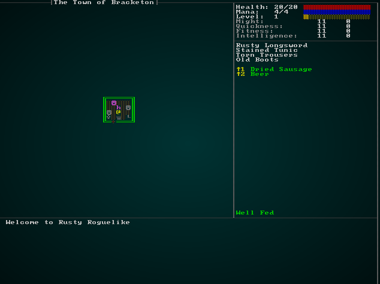

# The Limestone Caverns

---

***About this tutorial***

*This tutorial is free and open source, and all code uses the MIT license - so you are free to do with it as you like. My hope is that you will enjoy the tutorial, and make great games!*

*If you enjoy this and would like me to keep writing, please consider supporting [my Patreon](https://www.patreon.com/blackfuture).*

---

The [design document](./chapter_44.md) talks about the first real dungeon level being a network of limestone caverns. Limestone caves are amazing in real life; [Gaping Gill](https://www.atlasobscura.com/places/gaping-gill) in Yorkshire was one of my favorite places to visit as a kid (you may have seen it in *Monty Python and the Holy Grail* - the vorpal rabbit emerges from its entrance!). A trickle of water, given centuries to do its work, can carve out *amazing* caverns. The caves are predominantly made up of light gray rock, which wears smooth and reflective - giving amazing lighting effects!

## Cheating to help with levels

While working on new levels, it's helpful to have a quick and easy way to get there! So we're going to introduce *cheat mode*, to let you quickly navigate the dungeon to see your creations. This will be a lot like the other UI elements (such as inventory management) we've created, so the first thing we need is to open `main.rs` and add a new `RunState` for showing the cheats menu:

```rust
#[derive(PartialEq, Copy, Clone)]
pub enum RunState { AwaitingInput, 
    ...
    ShowCheatMenu
}
```

Then, add the following to your big `match` statement of game states:

```rust
RunState::ShowCheatMenu => {
    let result = gui::show_cheat_mode(self, ctx);
    match result {
        gui::CheatMenuResult::Cancel => newrunstate = RunState::AwaitingInput,
        gui::CheatMenuResult::NoResponse => {}
        gui::CheatMenuResult::TeleportToExit => {
            self.goto_level(1);
            self.mapgen_next_state = Some(RunState::PreRun);
            newrunstate = RunState::MapGeneration;
        }
    }
}
```

This asks `show_cheat_mode` for a response, and uses the "next level" code (same as if the player activates a staircase) to advance if the user selected `Teleport`. We haven't written that function and enumeration yet, so we open `gui.rs` and add it:

```rust
#[derive(PartialEq, Copy, Clone)]
pub enum CheatMenuResult { NoResponse, Cancel, TeleportToExit }

pub fn show_cheat_mode(_gs : &mut State, ctx : &mut Rltk) -> CheatMenuResult {
    let count = 2;
    let y = (25 - (count / 2)) as i32;
    ctx.draw_box(15, y-2, 31, (count+3) as i32, RGB::named(rltk::WHITE), RGB::named(rltk::BLACK));
    ctx.print_color(18, y-2, RGB::named(rltk::YELLOW), RGB::named(rltk::BLACK), "Cheating!");
    ctx.print_color(18, y+count as i32+1, RGB::named(rltk::YELLOW), RGB::named(rltk::BLACK), "ESCAPE to cancel");

    ctx.set(17, y, RGB::named(rltk::WHITE), RGB::named(rltk::BLACK), rltk::to_cp437('('));
    ctx.set(18, y, RGB::named(rltk::YELLOW), RGB::named(rltk::BLACK), rltk::to_cp437('T'));
    ctx.set(19, y, RGB::named(rltk::WHITE), RGB::named(rltk::BLACK), rltk::to_cp437(')'));

    ctx.print(21, y, "Teleport to exit");

    match ctx.key {
        None => CheatMenuResult::NoResponse,
        Some(key) => {
            match key {
                VirtualKeyCode::T => CheatMenuResult::TeleportToExit,
                VirtualKeyCode::Escape => CheatMenuResult::Cancel,
                _ => CheatMenuResult::NoResponse
            }
        }
    }
}
```

This should look familiar: it displays a cheat menu and offers the letter `T` for "Teleport to Exit".

Lastly, we need to add one more input to `player.rs`:

```rust
// Save and Quit
VirtualKeyCode::Escape => return RunState::SaveGame,

// Cheating!
VirtualKeyCode::Backslash => return RunState::ShowCheatMenu,
```

And there you go! If you `cargo run` now, you can press `\` (backslash), and `T` - and teleport right into the next level. This will make it a lot easier to design our level!



## Carving out the caverns

## Theming the caverns

## Just add water

## Populating the caverns

...

**The source code for this chapter may be found [here](https://github.com/thebracket/rustrogueliketutorial/tree/master/chapter-56-caverns)**


[Run this chapter's example with web assembly, in your browser (WebGL2 required)](http://bfnightly.bracketproductions.com/rustbook/wasm/chapter-56-caverns)
---

Copyright (C) 2019, Herbert Wolverson.

---