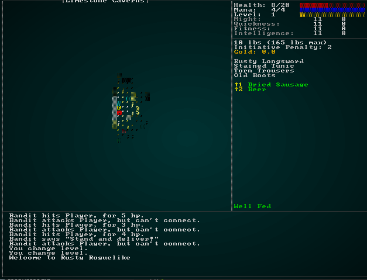
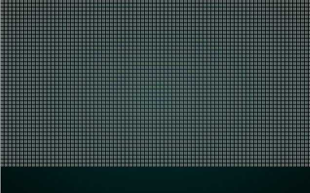

# Deeper Caverns

---

***About this tutorial***

*This tutorial is free and open source, and all code uses the MIT license - so you are free to do with it as you like. My hope is that you will enjoy the tutorial, and make great games!*

*If you enjoy this and would like me to keep writing, please consider supporting [my Patreon](https://www.patreon.com/blackfuture).*

---

We have the first layer of the limestone caverns looking pretty good. We know from the design document that the caverns give way to a dwarven fortress, but it seems reasonable to enjoy our cavern renderer for a little longer. Let's build a deeper caves level, focused on an orc and goblin camp, with peripheral wild monsters.

## More cheating!

It sucks when you die, when all you wanted was to check out your new level design! So we'll add a new cheat option: healing. Open up `gui.rs`, and edit `cheat_menu` and the associated result type:

```rust
#[derive(PartialEq, Copy, Clone)]
pub enum CheatMenuResult { NoResponse, Cancel, TeleportToExit, Heal }

pub fn show_cheat_mode(_gs : &mut State, ctx : &mut Rltk) -> CheatMenuResult {
    let count = 2;
    let mut y = (25 - (count / 2)) as i32;
    ctx.draw_box(15, y-2, 31, (count+3) as i32, RGB::named(rltk::WHITE), RGB::named(rltk::BLACK));
    ctx.print_color(18, y-2, RGB::named(rltk::YELLOW), RGB::named(rltk::BLACK), "Cheating!");
    ctx.print_color(18, y+count as i32+1, RGB::named(rltk::YELLOW), RGB::named(rltk::BLACK), "ESCAPE to cancel");

    ctx.set(17, y, RGB::named(rltk::WHITE), RGB::named(rltk::BLACK), rltk::to_cp437('('));
    ctx.set(18, y, RGB::named(rltk::YELLOW), RGB::named(rltk::BLACK), rltk::to_cp437('T'));
    ctx.set(19, y, RGB::named(rltk::WHITE), RGB::named(rltk::BLACK), rltk::to_cp437(')'));
    ctx.print(21, y, "Teleport to next level");

    y += 1;
    ctx.set(17, y, RGB::named(rltk::WHITE), RGB::named(rltk::BLACK), rltk::to_cp437('('));
    ctx.set(18, y, RGB::named(rltk::YELLOW), RGB::named(rltk::BLACK), rltk::to_cp437('H'));
    ctx.set(19, y, RGB::named(rltk::WHITE), RGB::named(rltk::BLACK), rltk::to_cp437(')'));
    ctx.print(21, y, "Heal all wounds");


    match ctx.key {
        None => CheatMenuResult::NoResponse,
        Some(key) => {
            match key {
                VirtualKeyCode::T => CheatMenuResult::TeleportToExit,
                VirtualKeyCode::H => CheatMenuResult::Heal,
                VirtualKeyCode::Escape => CheatMenuResult::Cancel,
                _ => CheatMenuResult::NoResponse
            }
        }
    }
}
```

Then visit `main.rs`, and in the cheat handler add support for healing:

```rust
gui::CheatMenuResult::Heal => {
    let player = self.ecs.fetch::<Entity>();
    let mut pools = self.ecs.write_storage::<Pools>();
    let mut player_pools = pools.get_mut(*player).unwrap();
    player_pools.hit_points.current = player_pools.hit_points.max;
    newrunstate = RunState::AwaitingInput;
}
```

With that in place, you are two keypresses away from free healing whenever you need it! This should make it easier to explore our later levels:



## Deep caverns basic layout

The deep caverns should still look natural, but should also feature a central area in which the goblinoids can camp. The Diffusion-Limited Aggregation algorithm we worked on in a previous chapter, specifically the "central attractor" mode, provides pretty much exactly what we want for basic layout:



In `map_builders/mod.rs`, we'll start by creating a new entry for level 4:

```rust
pub fn level_builder(new_depth: i32, rng: &mut rltk::RandomNumberGenerator, width: i32, height: i32) -> BuilderChain {
    println!("Depth: {}", new_depth);
    match new_depth {
        1 => town_builder(new_depth, rng, width, height),
        2 => forest_builder(new_depth, rng, width, height),
        3 => limestone_cavern_builder(new_depth, rng, width, height),
        4 => limestone_deep_cavern_builder(new_depth, rng, width, height),
        _ => random_builder(new_depth, rng, width, height)
    }
}
```

Then in `map_builders/limestone_cavern.rs` we can add the new function. This is a good start:

```rust
pub fn limestone_deep_cavern_builder(new_depth: i32, _rng: &mut rltk::RandomNumberGenerator, width: i32, height: i32) -> BuilderChain {
    let mut chain = BuilderChain::new(new_depth, width, height, "Deep Limestone Caverns");
    chain.start_with(DLABuilder::central_attractor());
    chain.with(AreaStartingPosition::new(XStart::LEFT, YStart::TOP));
    chain.with(VoronoiSpawning::new());
    chain.with(DistantExit::new());
    chain.with(CaveDecorator::new());
    chain
}
```

This actually gets us a pretty playable level; we could stop here and not be ashamed (although we clearly need to add some more monsters). We're not done yet, though!

## More mobs


...

**The source code for this chapter may be found [here](https://github.com/thebracket/rustrogueliketutorial/tree/master/chapter-59-caverns2)**


[Run this chapter's example with web assembly, in your browser (WebGL2 required)](http://bfnightly.bracketproductions.com/rustbook/wasm/chapter-59-caverns2)
---

Copyright (C) 2019, Herbert Wolverson.

---