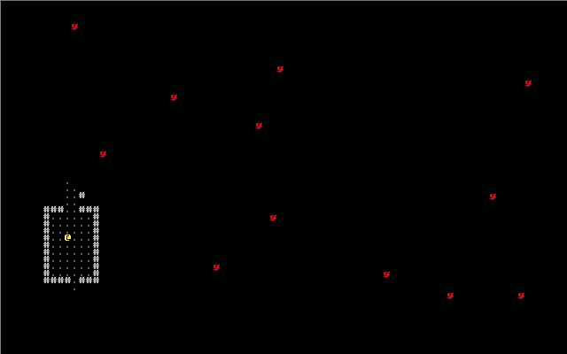
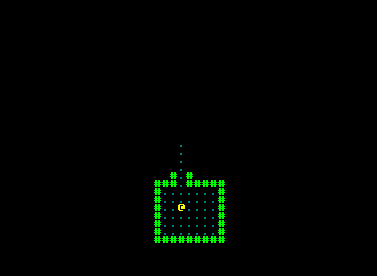
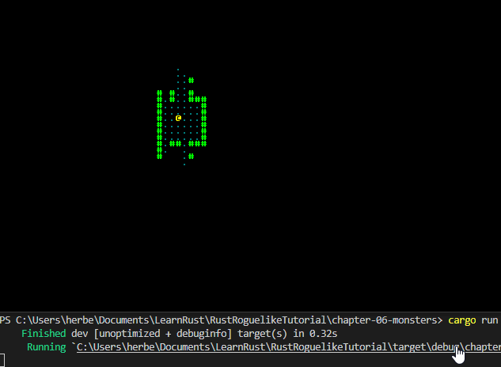

# Chapter 6 - Monsters

---

***About this tutorial***

*This tutorial is free and open source, and all code uses the MIT license - so you are free to do with it as you like. My hope is that you will enjoy the tutorial, and make great games!*

*If you enjoy this and would like me to keep writing, please consider supporting [my Patreon](https://www.patreon.com/blackfuture).*

---

A roguelike with no monsters is quite unusual, so lets add some! The good news is that we've already done some of the work for this: we can render them, and we can calculate what they can see. We'll build on the source from the previous chapter, and get some harmless monsters into play.

# Rendering a monster in the center of each room

We can simply add a `Renderable` component for each monster (we'll also add a `Viewshed` since we'll use it later). In our `main` function (in `main.rs`), add the following:

```rust
for room in map.rooms.iter().skip(1) {
    let (x,y) = room.center();
    gs.ecs.create_entity()
        .with(Position{ x, y })
        .with(Renderable{
            glyph: rltk::to_cp437('g'),
            fg: RGB::named(rltk::RED),
            bg: RGB::named(rltk::BLACK),
        })
        .with(Viewshed{ visible_tiles : Vec::new(), range: 8, dirty: true })
        .build();
}

gs.ecs.insert(map);
```

Notice the `skip(1)` to ignore the first room - we don't want the player starting with a mob on top of him/her/it! Running this (with `cargo run`) produces something like this:



That's a really good start! However, we're rendering monsters even if we can't see them. We probably only want to render the ones we can see. We can do this by modifying our render loop:

```rust
let positions = self.ecs.read_storage::<Position>();
let renderables = self.ecs.read_storage::<Renderable>();
let map = self.ecs.fetch::<Map>();

for (pos, render) in (&positions, &renderables).join() {
    let idx = map.xy_idx(pos.x, pos.y);
    if map.visible_tiles[idx] { ctx.set(pos.x, pos.y, render.fg, render.bg, render.glyph) }
}
```

We get the map from the ECS, and use it to obtain an index - and check if the tile is visible. If it is - we render the renderable. There's no need for a special case for the player - since they can generally be expected to see themselves! The result is pretty good:



# Add some monster variety

It's rather dull to only have one monster type, so we'll amend our monster spawner to be able to create `g`oblins and `o`rcs.

Here's the spawner code:

```rust
let mut rng = rltk::RandomNumberGenerator::new();
for room in map.rooms.iter().skip(1) {
    let (x,y) = room.center();

    let glyph : u8;
    let roll = rng.roll_dice(1, 2);
    match roll {
        1 => { glyph = rltk::to_cp437('g') }
        _ => { glyph = rltk::to_cp437('o') }
    }

    gs.ecs.create_entity()
        .with(Position{ x, y })
        .with(Renderable{
            glyph: glyph,
            fg: RGB::named(rltk::RED),
            bg: RGB::named(rltk::BLACK),
        })
        .with(Viewshed{ visible_tiles : Vec::new(), range: 8, dirty: true })
        .build();
}
```

Obviously, when we start adding in combat we'll want more variety - but it's a good start. Run the program (`cargo run`), and you'll see a roughly 50/50 split between orcs and goblins.

# Making the monsters think

Now to start making the monsters think! For now, they won't actually *do* much, beyond pondering their lonely existence. We should start by adding a tag component to indicate that an entity *is* a monster. In `components.rs` we add a simple struct:

```rust
#[derive(Component, Debug)]
pub struct Monster {}
```

Of course, we need to register it in `main.rs`: `gs.ecs.register::<Monster>();`. We should also amend our spawning code to apply it to monsters:

```rust
gs.ecs.create_entity()
    .with(Position{ x, y })
    .with(Renderable{
        glyph: glyph,
        fg: RGB::named(rltk::RED),
        bg: RGB::named(rltk::BLACK),
    })
    .with(Viewshed{ visible_tiles : Vec::new(), range: 8, dirty: true })
    .with(Monster{})
    .build();
```

Now we make a system for monster thought. We'll make a new file, `monster_ai_system.rs`. We'll give it some basically non-existent intelligence:

```rust
extern crate specs;
use specs::prelude::*;
use super::{Viewshed, Position, Map, Monster};
extern crate rltk;
use rltk::{field_of_view, Point, console};

pub struct MonsterAI {}

impl<'a> System<'a> for MonsterAI {
    type SystemData = ( ReadStorage<'a, Viewshed>, 
                        ReadStorage<'a, Position>,
                        ReadStorage<'a, Monster>);

    fn run(&mut self, data : Self::SystemData) {
        let (viewshed, pos, monster) = data;

        for (viewshed,pos,_monster) in (&viewshed, &pos, &monster).join() {
            console::log("Monster considers their own existence");
        }
    }
}
```

Note that we're importing `console` from `rltk` - and printing with `console::log`. This is a helper provided by RLTK that detects if you are compiling to a regular program or a Web Assembly; if you are using a regular program, it calls `println!` and outputs to the console. If you are in `WASM`, it outputs to the *browser* console.

We'll also extend the system runner in `main.rs` to call it:

```rust
impl State {
    fn run_systems(&mut self) {
        let mut vis = VisibilitySystem{};
        vis.run_now(&self.ecs);
        let mut mob = MonsterAI{};
        mob.run_now(&self.ecs);
        self.ecs.maintain();
    }
}
```

If you `cargo run` your project now, it will be very slow - and your console will fill up with "Monster considers their own existence". The AI is running - but it's running every tick!

# Turn-based game, in a tick-based world

To prevent this - and make a turn-based game - we introduce a new concept to the game state. The game is either "running" or "waiting for input" - so we make an `enum` to handle this:

```rust
#[derive(PartialEq, Copy, Clone)]
pub enum RunState { Paused, Running }
```

Notice the `derive` macro! Derivation is a way to ask Rust (and crates) to add code to your structure for you, to cut down on typing boilerplate. In this case, the `enum` needs a few extra features. `PartialEq` allows you to compare the `RunState` with other `RunState` variables to determine if they are the same (or different). `Copy` marks it as a "copy" type - it can safely be copied in memory (meaning it has no pointers that will be messed up doing this). `Clone` quietly adds a `.clone()` function to it, allowing you to make a memory copy that way.

Next, we need to add it into the `State` structure:

```rust
pub struct State {
    pub ecs: World,
    pub runstate : RunState
}
```

In turn, we need to amend our State creator to include a `runstate: RunState::Running`:

```rust
let mut gs = State {
    ecs: World::new(),
    runstate : RunState::Running
};
```

Now, we change our `tick` function to only run the simulation when the game isn't paused - and otherwise to ask for user input:

```rust
if self.runstate == RunState::Running {
    self.run_systems();
    self.runstate = RunState::Paused;
} else {
    self.runstate = player_input(self, ctx);
}
```

As you can see, `player_input` now returns a state. Here's the new code for it:

```rust
pub fn player_input(gs: &mut State, ctx: &mut Rltk) -> RunState {
    // Player movement
    match ctx.key {
        None => { return RunState::Paused } // Nothing happened
        Some(key) => match key {
            VirtualKeyCode::Left => try_move_player(-1, 0, &mut gs.ecs),
            VirtualKeyCode::Numpad4 => try_move_player(-1, 0, &mut gs.ecs),
            VirtualKeyCode::H => try_move_player(-1, 0, &mut gs.ecs),
            VirtualKeyCode::Right => try_move_player(1, 0, &mut gs.ecs),
            VirtualKeyCode::Numpad6 => try_move_player(1, 0, &mut gs.ecs),
            VirtualKeyCode::L => try_move_player(1, 0, &mut gs.ecs),
            VirtualKeyCode::Up => try_move_player(0, -1, &mut gs.ecs),
            VirtualKeyCode::Numpad8 => try_move_player(0, -1, &mut gs.ecs),
            VirtualKeyCode::K => try_move_player(0, -1, &mut gs.ecs),
            VirtualKeyCode::Down => try_move_player(0, 1, &mut gs.ecs),
            VirtualKeyCode::Numpad2 => try_move_player(0, 1, &mut gs.ecs),
            VirtualKeyCode::J => try_move_player(0, 1, &mut gs.ecs),
            _ => { return RunState::Paused }
        },
    }
    RunState::Running
}
```

If you launch `cargo run` now, the game is back up to speed - and the monsters only think about what to do when you move. That's a basic turn-based tick loop!

# Quiet monsters until they see you

You *could* let monsters think every time anything moves (and you probably will when you get into deeper simulation), but for now lets quiet them down a bit - and have them react if they can see the player.

It's *highly* likely that systems will often want to know where the player is - so lets add that as a resource. In `main.rs`, one line puts it in (I don't recommend doing this for non-player entities; there are only so many resources available - but the player is one we use over and over again):

```rust
gs.ecs.insert(Point::new(player_x, player_y));
```

In `player.rs`, `try_move_player()`, update the resource when the player moves:

```rust
let mut ppos = ecs.write_resource::<Point>();
ppos.x = pos.x;
ppos.y = pos.y;
```

We can then use that in our `monster_ai_system`. Here's a working version:

```rust
extern crate specs;
use specs::prelude::*;
use super::{Viewshed, Monster};
extern crate rltk;
use rltk::{Point, console};

pub struct MonsterAI {}

impl<'a> System<'a> for MonsterAI {
    type SystemData = ( ReadExpect<'a, Point>,
                        ReadStorage<'a, Viewshed>, 
                        ReadStorage<'a, Monster>);

    fn run(&mut self, data : Self::SystemData) {
        let (player_pos, viewshed, monster) = data;

        for (viewshed,_monster) in (&viewshed, &monster).join() {
            if viewshed.visible_tiles.contains(&*player_pos) {
                console::log(format!("Monster shouts insults"));
            }
        }
    }
}
```

If you `cargo run` this, you'll be able to move around - and your console will gain "Monster shouts insults" from time to time when a monster can see you.

# Differentiating our monsters

Monsters should have names, so we know who is yelling at us! So we create a new component, `Name`. In `components.rs`, we add:

```rust
#[derive(Component, Debug)]
pub struct Name {
    pub name : String
}
```

We also register it in `main.rs`, which you should be comfortable with by now! We'll also add some commands to add names to our monsters and the player. So our monster spawner looks like this:

```rust
for (i,room) in map.rooms.iter().skip(1).enumerate() {
    let (x,y) = room.center();

    let glyph : u8;
    let name : String;
    let roll = rng.roll_dice(1, 2);
    match roll {
        1 => { glyph = rltk::to_cp437('g'); name = "Goblin".to_string(); }
        _ => { glyph = rltk::to_cp437('o'); name = "Orc".to_string(); }
    }

    gs.ecs.create_entity()
        .with(Position{ x, y })
        .with(Renderable{
            glyph: glyph,
            fg: RGB::named(rltk::RED),
            bg: RGB::named(rltk::BLACK),
        })
        .with(Viewshed{ visible_tiles : Vec::new(), range: 8, dirty: true })
        .with(Monster{})
        .with(Name{ name: format!("{} #{}", &name, i) })
        .build();
}
```

Now we adjust the `monster_ai_system` to include the monster's name. The new AI looks like this:

```rust
extern crate specs;
use specs::prelude::*;
use super::{Viewshed, Monster, Name};
extern crate rltk;
use rltk::{Point};

pub struct MonsterAI {}

impl<'a> System<'a> for MonsterAI {
    type SystemData = ( ReadExpect<'a, Point>,
                        ReadStorage<'a, Viewshed>, 
                        ReadStorage<'a, Monster>,
                        ReadStorage<'a, Name>);

    fn run(&mut self, data : Self::SystemData) {
        let (player_pos, viewshed, monster, name) = data;

        for (viewshed,_monster,name) in (&viewshed, &monster, &name).join() {
            if viewshed.visible_tiles.contains(&*player_pos) {
                console::log(&format!("{} shouts insults", name.name));
            }
        }
    }
}
```

We also need to give the player a name; we've explicitly included names in the AI's join, so we better be sure that the player has one! Otherwise, the AI will ignore the player altogether. In `main.rs`, we'll include one in the `Player` creation:

```rust
gs.ecs
    .create_entity()
    .with(Position { x: player_x, y: player_y })
    .with(Renderable {
        glyph: rltk::to_cp437('@'),
        fg: RGB::named(rltk::YELLOW),
        bg: RGB::named(rltk::BLACK),
    })
    .with(Player{})
    .with(Viewshed{ visible_tiles : Vec::new(), range: 8, dirty: true })
    .with(Name{name: "Player".to_string() })
    .build();
```

If you `cargo run` the project, you now see things like *Goblin #9 shouts insults* - so you can tell who is shouting.



And that's a wrap for chapter 6; we've added a variety of foul-mouthed monsters to hurl insults at your fragile ego! In this chapter, we've begun to see some of the benefits of using an Entity Component System: it was really easy to add newly rendered monsters, with a bit of variety, and start storing names for things. The Viewshed code we wrote earlier worked with minimal modification to give visibility to monsters - and our new monster AI was able to take advantage of what we've already built to quite efficiently say bad things to the player.

**The source code for this chapter may be found [here](https://github.com/thebracket/rustrogueliketutorial/tree/master/chapter-06-monsters)**

[Run this chapter's example with web assembly, in your browser (WebGL2 required)](https://bfnightly.bracketproductions.com/rustbook/wasm/chapter-06-monsters/)

---

Copyright (C) 2019, Herbert Wolverson.

---