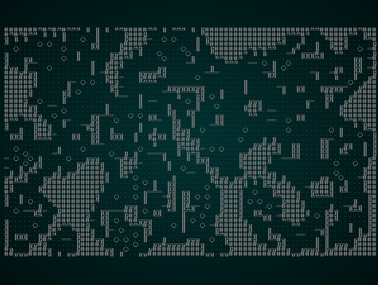

# Mushroom Forest

---

***About this tutorial***

*This tutorial is free and open source, and all code uses the MIT license - so you are free to do with it as you like. My hope is that you will enjoy the tutorial, and make great games!*

*If you enjoy this and would like me to keep writing, please consider supporting [my Patreon](https://www.patreon.com/blackfuture).*

---

The design document says that once you've conquered the dragon in the fortress, you proceed into a vast mushroom forest. This is an interesting transition: we've done forests before, but we want to make the mushroom forest different from the *Into The Woods* level. On this level, we also want to transition between the fortress and the forest - so we'll need another layered approach.

We'll start by adding a new function to the level builder in `map_builder/mod.rs`:

```rust
mod mushroom_forest;
use mushroom_forest::*;
...
pub fn level_builder(new_depth: i32, rng: &mut rltk::RandomNumberGenerator, width: i32, height: i32) -> BuilderChain {
    println!("Depth: {}", new_depth);
    match new_depth {
        1 => town_builder(new_depth, rng, width, height),
        2 => forest_builder(new_depth, rng, width, height),
        3 => limestone_cavern_builder(new_depth, rng, width, height),
        4 => limestone_deep_cavern_builder(new_depth, rng, width, height),
        5 => limestone_transition_builder(new_depth, rng, width, height),
        6 => dwarf_fort_builder(new_depth, rng, width, height),
        7 => mushroom_entrance(new_depth, rng, width, height),
        _ => random_builder(new_depth, rng, width, height)
    }
}
```

Now we'll make a new file, `map_builder/mushroom_forest.rs`:

```rust
use super::{BuilderChain, XStart, YStart, AreaStartingPosition, 
    CullUnreachable, VoronoiSpawning,
    AreaEndingPosition, XEnd, YEnd, CellularAutomataBuilder, PrefabBuilder, WaveformCollapseBuilder};
use crate::map_builders::prefab_builder::prefab_sections::UNDERGROUND_FORT;

pub fn mushroom_entrance(new_depth: i32, _rng: &mut rltk::RandomNumberGenerator, width: i32, height: i32) -> BuilderChain {
    let mut chain = BuilderChain::new(new_depth, width, height, "Into The Mushroom Grove");
    chain.start_with(CellularAutomataBuilder::new());
    chain.with(WaveformCollapseBuilder::new());
    chain.with(AreaStartingPosition::new(XStart::CENTER, YStart::CENTER));
    chain.with(CullUnreachable::new());
    chain.with(AreaStartingPosition::new(XStart::RIGHT, YStart::CENTER));
    chain.with(AreaEndingPosition::new(XEnd::LEFT, YEnd::CENTER));
    chain.with(VoronoiSpawning::new());
    chain.with(PrefabBuilder::sectional(UNDERGROUND_FORT));
    chain
}
```

This should look familiar: we're using the cellular automata again - but mixing it up with some wave function collapse, and then adding a fort edge on top of it. This gives a pretty decent start for a forest template, albeit one that needs visual work (and a population):



## Theming the mushroom grove

We've used split themes before (for entering the fortress), so it shouldn't be a surprise that we'll be opening up `map/themes.rs` and adding another one! In this case, we want the fortress theme to apply to the fortifications on the East of the map, and a new mushroom grove look to apply to the rest.

We can update `tile_glyph` to look like this:

```rust
pub fn tile_glyph(idx: usize, map : &Map) -> (u8, RGB, RGB) {
    let (glyph, mut fg, mut bg) = match map.depth {
        7 => {
            let x = idx as i32 % map.width;
            if x > map.width-16 {
                get_tile_glyph_default(idx, map)
            } else {
                get_mushroom_glyph(idx, map)
            }
        }
        5 => {
            let x = idx as i32 % map.width;
            if x < map.width/2 {
                get_limestone_cavern_glyph(idx, map)
            } else {
                get_tile_glyph_default(idx, map)
            }
        }
        4 => get_limestone_cavern_glyph(idx, map),
        3 => get_limestone_cavern_glyph(idx, map),
        2 => get_forest_glyph(idx, map),
        _ => get_tile_glyph_default(idx, map)
    };
    ...
```

The `get_mushroom_glyph` function is basically the same as `get_forest_glyph`, but changed to look more like a mushroom grove from the game Dwarf Fortress (yay, Plump Helmets!):

```rust
fn get_mushroom_glyph(idx:usize, map: &Map) -> (u8, RGB, RGB) {
    let glyph;
    let fg;
    let bg = RGB::from_f32(0., 0., 0.);

    match map.tiles[idx] {
        TileType::Wall => { glyph = rltk::to_cp437('♠'); fg = RGB::from_f32(1.0, 0.0, 1.0); }
        TileType::Bridge => { glyph = rltk::to_cp437('.'); fg = RGB::named(rltk::GREEN); }
        TileType::Road => { glyph = rltk::to_cp437('≡'); fg = RGB::named(rltk::CHOCOLATE); }
        TileType::Grass => { glyph = rltk::to_cp437('"'); fg = RGB::named(rltk::GREEN); }
        TileType::ShallowWater => { glyph = rltk::to_cp437('~'); fg = RGB::named(rltk::CYAN); }
        TileType::DeepWater => { glyph = rltk::to_cp437('~'); fg = RGB::named(rltk::BLUE); }
        TileType::Gravel => { glyph = rltk::to_cp437(';'); fg = RGB::from_f32(0.5, 0.5, 0.5); }
        TileType::DownStairs => { glyph = rltk::to_cp437('>'); fg = RGB::from_f32(0., 1.0, 1.0); }
        TileType::UpStairs => { glyph = rltk::to_cp437('<'); fg = RGB::from_f32(0., 1.0, 1.0); }
        _ => { glyph = rltk::to_cp437('"'); fg = RGB::from_f32(0.0, 0.6, 0.0); }
    }

    (glyph, fg, bg)
}
```

This gives a slightly trippy but quite nice world view:


...

**The source code for this chapter may be found [here](https://github.com/thebracket/rustrogueliketutorial/tree/master/chapter-68-mushrooms)**


[Run this chapter's example with web assembly, in your browser (WebGL2 required)](http://bfnightly.bracketproductions.com/rustbook/wasm/chapter-68-mushrooms)
---

Copyright (C) 2019, Herbert Wolverson.

---